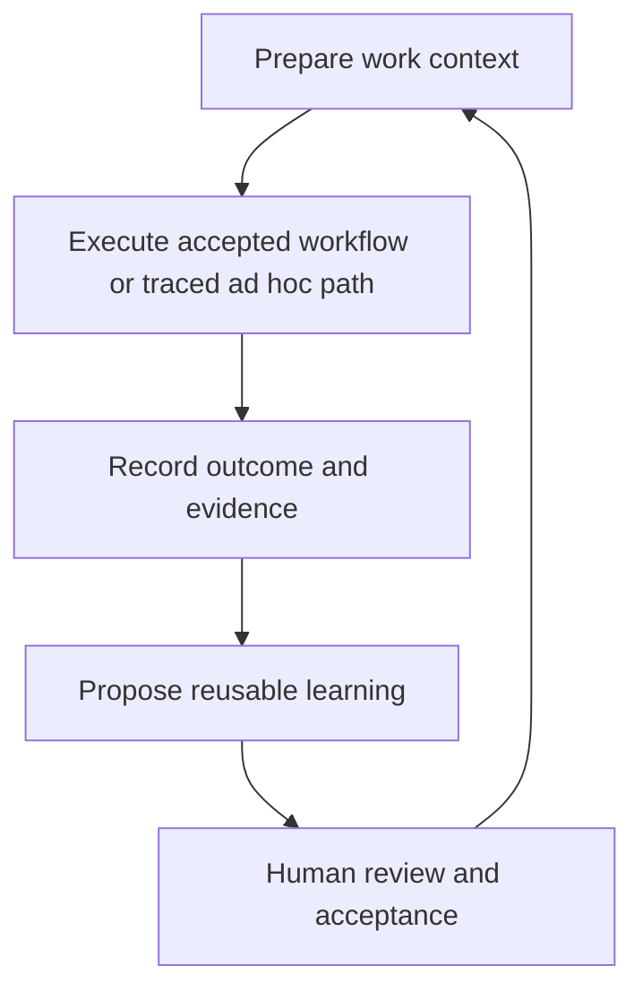

# Punakawan Agent Context and Continuous Improvement Plan

**Status:** Proposed  
**Baseline:** `main` at `10b672527586151eb32f2c99703f3a1e012dc067`  
**Goal:** Make each completed agent task improve the speed and quality of later work by reusing accepted workflows, project metadata, and project knowledge.

## 1. Executive summary

Punakawan already has most of the required building blocks:

- versioned workflow definitions;
- append-only workflow runs;
- revisioned project metadata;
- provenance-aware project knowledge and deterministic search;
- role restrictions, approvals, evidence, contradictions, and artifact review.

The main problem is integration. Workflow definitions are not actually executed as definitions, required metadata is not enforced during workflow startup, knowledge is often reduced to titles when injected into context, and completed work does not produce a structured outcome that can become a reviewed improvement.

The proposed solution is a single **Project Context Spine**:

| Pillar | Question answered | Canonical form |
|---|---|---|
| Workflow | How should this work be done? | Versioned workflow definition |
| Project metadata | What stable project settings and defaults apply? | Revisioned key/description/value entries |
| Knowledge | What is known, why, and from which evidence? | Provenance- and validity-aware knowledge records |

Every substantial agent run follows one bounded loop:



“Self-learning” here does **not** mean autonomous model training or unreviewed mutation. It means the connected agent can identify a reusable lesson, support it with evidence, and submit it to the existing review lifecycle. Only accepted proposals become canonical project context.

## 2. Design constraints

The implementation should follow these constraints throughout:

1. **One integration path.** Build one context preparation service, one run context snapshot, one structured outcome, and one proposal lifecycle shared by all three pillars.
2. **Human-controlled canon.** Agents may observe and propose. They may not silently rewrite, activate, or promote canonical workflow, metadata, or knowledge.
3. **Deterministic core.** Punakawan remains a no-LLM system. Selection, validation, deduplication, state transitions, and acceptance are deterministic. The connected agent supplies reasoning.
4. **Reuse existing stores.** Continue using YAML, JSONL, Dolt, and the current review stores. Do not add a database or event platform.
5. **No arbitrary command replay.** A workflow step names a registered capability and intent, never a captured shell command.
6. **No fuzzy workflow routing in v1.** Workflow selection uses an explicit workflow ID or exact capability/intent selectors. Ambiguity is returned to the agent instead of guessed.
7. **Bounded context.** Context selection stays token- and count-bounded, records why each item was selected, and never dumps the whole project memory.
8. **Backward compatible adoption.** Existing ad hoc runs and direct one-off tools continue to work. The completion gate applies only to runs using the context loop.

## 3. Current-state gaps to close

### 3.1 Workflow definitions and runs are disconnected

`internal/workflowdef` has useful versioned definitions with steps, inputs, required metadata, capabilities, approvals, output, and role restrictions. However, Panel invocation currently creates a generic `implementation-only` run and encodes the definition ID in `Objective`. The run does not retain the definition revision or hash, validate its required metadata, initialize its steps, or enforce its role restrictions.

This must be fixed at the model boundary. Parsing the workflow ID back out of `Objective` would be a band-aid and must not be used.

### 3.2 Capability validation has two sources of truth

`workflowdef.KnownMCPCapabilities()` is maintained separately from the actual MCP tool registrations and is already behind them. Adapter operations are also omitted from the Panel invocation capability set.

Capability names must be derived from the runtime registration catalog and loaded adapter manifests. The same catalog should drive:

- workflow definition validation;
- workflow invocation validation;
- role/capability enforcement;
- capability listing in the Panel.

### 3.3 Required metadata is advisory rather than required

The project metadata store already supports revisioning, snapshots, optimistic locking, audit, and secret-like key rejection. Its selector can provide bounded context, but workflow `required_metadata` is not automatically resolved or enforced.

Starting a definition-backed run must either:

- attach every required metadata key to the context snapshot; or
- return the missing keys and move the run to `awaiting-clarification`.

### 3.4 Knowledge retrieval loses useful content

The search layer is already strong enough for the current problem: identifiers, aliases, BM25F, fuzzy fallback, scope bonuses, relation expansion, and no external model dependency. The weakness is after retrieval:

- default search can surface unsafe lifecycle states;
- capsules commonly expose only record title and selection reason;
- agents cannot batch-fetch complete typed records through a generic MCP tool;
- retrieval recipes are not connected to workflow context preparation.

The fix is better filtering and rendering, not a vector database.

### 3.5 Work has no reusable outcome

Workflow state records where a run is, but not what happened in a form suitable for learning. There is no required structured outcome, step-level deviation record, or stable link from evidence to a proposed project improvement.

Without this record, “learning” would require guessing from transcripts or logs. That is unreliable and should not be implemented.

### 3.6 Review support stops before the three pillars

The shared artifact review flow already supports comments, proposals, diffs, validation, acceptance, rejection, requested changes, immutable versions, and optimistic conflict handling. Its artifact type is currently limited to plans and retrieval recipes.

The correct extension is to add adapters for workflow, project metadata, and knowledge. Separate pending-file conventions or direct agent writes would duplicate governance and create inconsistent behavior.

## 4. Target architecture

### 4.1 A run is the context boundary

Use the existing workflow run as the durable boundary for context-aware work. Do not add a separate session database.

Extend `WorkflowRun` with:

```yaml
definition_ref:
  id: review-pr
  revision: 4
  content_hash: sha256:...
inputs:
  repository: gdncomm-yunaz-ramadhan/punakawan
context_snapshot:
  prepared_at: 2026-07-26T10:00:00Z
  digest: sha256:...
  project_metadata_revision: 7
  metadata:
    - key: test.command
      value: go test ./...
      reason: required_by_workflow
  knowledge:
    - id: pkw:decision/punakawan/no-llm-core
      content_hash: sha256:...
      validity: verified
      reason: exact_scope_and_intent
  missing:
    - kind: metadata
      key: release.owner
step_progress:
  - step_id: inspect
    state: ready
    evidence_ids: []
outcome:
  status: success
  summary: Review completed and findings submitted.
  evidence_ids: [evidence-123]
  deviations: []
```

The snapshot contains bounded values and immutable references, not a copy of the entire knowledge store. Its digest must cover workflow definition reference, selected metadata, selected knowledge references and hashes, role configuration revision, and inputs.

For an ad hoc run, `definition_ref` is absent. The actual path is still recorded through capability events and the structured outcome, allowing a later workflow proposal without pretending a workflow already existed.

### 4.2 Exact workflow selectors

Add an optional selector block to a workflow definition:

```yaml
selectors:
  - capability: github.pull_request
    intent: review
```

Resolution order:

1. explicit workflow ID and optional revision supplied by the caller;
2. one enabled workflow with an exact capability/intent selector match;
3. no workflow if there is no match;
4. return candidates without selecting if more than one workflow matches.

Existing definitions remain valid without selectors and can still be invoked explicitly.

### 4.3 Central capability registry and enforcement

Create a small `internal/capability` package with a registry interface independent of `mcpserver` and `workflowdef`. Populate it from:

- MCP tool descriptors during server registration;
- adapter operation manifests when adapters load.

Wrap MCP handlers at the common registration boundary. The wrapper should read an optional `work_context_id` and, when present:

- resolve the run and definition reference;
- reject capabilities outside the workflow allowlist;
- apply project and workflow role restrictions;
- enforce required approvals;
- append a capability event with run, role, tool, result, and duration.

This avoids editing enforcement logic into every handler and eliminates the hand-maintained capability mirror.

Calls without `work_context_id` keep their current behavior unless the tool already has an approval or role rule.

### 4.4 Context preparation service

Add `internal/workcontext` as the only service that composes the three pillars. It should:

1. resolve or validate the workflow definition;
2. validate and default declared inputs;
3. resolve required metadata;
4. select optional metadata through the existing priority selector;
5. retrieve scoped knowledge through the existing search index;
6. execute a verified retrieval recipe internally when an exact capability/intent recipe exists;
7. filter and render knowledge safely;
8. stamp role configuration and build the context digest;
9. append the updated run.

Retrieval recipes remain a knowledge lookup implementation. They do not become a fourth pillar or a second workflow engine.

### 4.5 Knowledge eligibility policy

Default context preparation should use lifecycle state explicitly:

| Validity state | Automatic context behavior |
|---|---|
| `verified`, `observed` | Eligible |
| `inferred` | May appear in a clearly marked caution section |
| `assumed` | Only when explicitly requested |
| `draft`, `validating` | Excluded |
| `disputed` | Excluded as guidance; surface the relevant contradiction warning |
| `stale` | Excluded; report as missing/stale context |
| `superseded`, `invalid` | Excluded |

Fix capsule rendering so each supported record type supplies a useful bounded summary from its actual content. Add a batch read for full records when the agent needs detail. Include selected metadata and knowledge hashes in the capsule/context digest.

## 5. Agent-facing contract

### 5.1 Required behavior

Update server instructions and role prompts with a short, testable contract:

1. Before substantial project work, call `prepare_work_context`.
2. Reuse an accepted workflow when there is one clear match.
3. If there is no accepted workflow, continue with an ad hoc run and record the actual path; do not invent a canonical workflow.
4. Pass the returned `work_context_id` to run-scoped capability calls.
5. Complete workflow steps with evidence or an explicit deviation reason.
6. Before completing a context-aware run, call `record_work_outcome`.
7. Propose only reusable, evidence-backed improvements.
8. Never claim a proposal is canonical before human acceptance.

One-off searches, reads, and narrowly scoped tools do not need a run.

### 5.2 Minimal MCP changes

Prefer a small surface:

| Tool | Responsibility |
|---|---|
| `prepare_work_context` | Create/resume a run, resolve workflow, and return the bounded snapshot and next action |
| `get_next_workflow_step` | Return ready steps and any approval or missing-context block |
| `complete_workflow_step` | Attach evidence/deviation and deterministically unlock dependent steps |
| `get_knowledge_records` | Batch-read complete typed knowledge records by ID |
| `record_work_outcome` | Persist result, evidence, deviations, and reusable observations |
| `propose_project_learning` | Open or update a reviewed proposal for workflow, metadata, or knowledge |

Keep the existing workflow and knowledge tools for compatibility. Internally, route overlapping operations through the new services so there are not two behavior paths.

Every mutating MCP tool should accept the optional `work_context_id` through the shared registration wrapper rather than duplicating it in handler logic.

### 5.3 Step execution semantics

Do not build an autonomous executor inside Punakawan. The connected agent remains the executor.

For a definition-backed run:

- initialize each declared step as `pending`;
- derive `ready` from `input_from`;
- require the step capability to be allowed and registered;
- require approval before a protected step;
- accept completion only with evidence IDs or a deviation reason;
- derive newly ready steps after completion;
- move to review only when all required steps are complete;
- retain the existing coarse run state machine for lifecycle reporting.

The minimal step states are `pending`, `ready`, `completed`, and `blocked`. Additional scheduler states are unnecessary for v1.

## 6. Structured outcomes and learning

### 6.1 Outcome schema

`record_work_outcome` should persist:

- `status`: `success`, `partial`, or `failed`;
- concise summary;
- evidence IDs;
- completed output references;
- workflow deviations with step, reason, and actual capability used;
- missing or stale context encountered;
- reusable observations.

An observation is not yet canonical knowledge. It is a traceable input to a proposal.

Completion rules:

- a context-aware run cannot enter `completed` without an outcome;
- a definition-backed run also requires completed steps, satisfied approvals, and no unresolved blocking Bagong finding;
- failed and cancelled runs may record a partial outcome but are not forced through successful completion checks.

### 6.2 Learning classification

The connected agent classifies a reusable observation:

| Observation | Proposal target |
|---|---|
| Repeated or clearly reusable sequence of registered capabilities | Workflow |
| Stable project-wide setting, default, owner, command, or convention | Project metadata |
| Fact, decision, constraint, contract, failure lesson, or verified relationship | Knowledge |
| Conflicting accepted claims | Existing contradiction flow |
| Repeated workflow failure or deviation | Workflow revision proposal |

Do not derive these proposals by mining chat transcripts. They must reference the structured outcome and evidence.

### 6.3 Proposal envelope

Extend the existing artifact proposal model rather than creating a parallel queue:

```yaml
artifact_type: workflow
target_id: review-pr
base_revision: 4
candidate: {}
rationale: The last three reviews used the same compatibility check.
evidence_ids: [evidence-123, evidence-456]
source_run_ids: [run-12, run-19]
support_count: 2
created_by: semar
```

Add three concrete artifact adapters:

- **workflow adapter:** validates schema and capabilities, writes a new immutable definition revision, never activates it automatically;
- **metadata adapter:** validates key/value policy and optimistic revision, updates the canonical metadata snapshot on acceptance;
- **knowledge adapter:** validates provenance and lifecycle, writes a new immutable record version and supersedes the previous record when applicable.

Do not build a generic schema language. A small typed adapter per pillar is easier to audit and preserves domain validation.

### 6.4 Deterministic deduplication

Before opening a proposal, calculate a stable fingerprint:

- workflow: project scope + selector + normalized ordered step capability/intent graph;
- metadata: project scope + case-normalized key;
- knowledge: project scope + record type + normalized subject + source content hash.

If the same pending proposal exists, append the new run/evidence reference and increment `support_count`. If an equivalent accepted artifact already exists, record reuse and do not create a proposal. If the candidate conflicts with accepted knowledge, route it to contradiction review.

Support count helps reviewers; it is not an automatic acceptance threshold.

## 7. Role responsibilities

Keep responsibilities aligned with existing roles:

| Role | Context-loop responsibility |
|---|---|
| Semar | Prepares context, synthesizes outcomes, and submits learning proposals |
| Gareng | Detects contradictions, unsafe reuse, missing assumptions, and workflow-policy violations |
| Petruk | Executes ready steps and records concrete deviations and evidence |
| Bagong | Independently verifies the outcome from raw evidence and controls blocking findings |
| Human/Panel | Accepts, rejects, edits, and explicitly activates canonical improvements |

Workflow-specific role restrictions must be evaluated with the actual workflow ID and revision from the run, never with blank workflow identifiers.

## 8. Panel changes

Keep the Panel changes narrow:

1. Add a single **Context Improvements** inbox backed by the existing artifact review APIs.
2. Show proposal type, diff, rationale, evidence, source runs, support count, validation result, and conflict status.
3. Reuse the current accept, reject, request-changes, and comment interactions.
4. On run detail, show the workflow revision, selected context, missing context, step progress, outcome, and resulting proposals.
5. On workflow detail, separate “accepted revision” from “enabled revision”; acceptance must not silently enable it.

Do not add dashboards or recommendation scoring in the first release. Emit the required events first; simple metrics can be computed later from existing journals.

## 9. Implementation plan

Each phase should be a reviewable PR with its own tests and no dormant framework code.

### Phase 1 — Correct the workflow foundation

**Changes**

- Add the shared runtime capability registry.
- Derive MCP and adapter capabilities from registration and manifests.
- Remove production use of the hand-maintained capability mirror.
- Add workflow selectors.
- Extend run protocol fields for definition reference, inputs, context snapshot, and step progress.
- Make Panel/API workflow invocation create a definition-aware run.
- Validate inputs and required metadata at invocation.
- Stamp and enforce workflow-specific role settings.

**Exit criteria**

- Registered capability and workflow-validation capability sets cannot drift.
- A run records exact workflow ID, revision, and content hash.
- Missing required metadata produces `awaiting-clarification`.
- No code relies on parsing a workflow ID from `Objective`.

### Phase 2 — Build the Project Context Spine

**Changes**

- Add `internal/workcontext`.
- Implement `prepare_work_context`.
- Connect metadata selection, knowledge search, and verified recipes.
- Add lifecycle-aware knowledge filtering.
- Replace title-only capsule summaries with typed bounded summaries.
- Add `get_knowledge_records`.
- Include metadata revision and all selected content hashes in the digest.

**Exit criteria**

- The same inputs and store revisions produce the same context digest.
- Unsafe knowledge states never appear as accepted guidance.
- Every returned item includes a selection reason.
- Required metadata and selected knowledge are visible to the agent without separate discovery calls.

### Phase 3 — Close the run and outcome loop

**Changes**

- Add central `work_context_id` middleware.
- Implement step readiness and completion.
- Apply capability, role, and approval rules at the shared call boundary.
- Emit complete run-scoped capability events.
- Implement `record_work_outcome`.
- Gate successful completion on outcome, workflow steps, approval, and Bagong review.
- Update server and role instructions.

**Exit criteria**

- A definition-backed workflow can be resumed after restart without losing step state.
- A disallowed capability is rejected before execution.
- A completed run always has a structured, evidence-linked outcome.
- Ad hoc runs retain enough structured trace to propose a future workflow.

### Phase 4 — Add reviewed learning

**Changes**

- Extend artifact types with workflow, project metadata, and knowledge.
- Implement the three typed artifact adapters.
- Implement `propose_project_learning` and deterministic deduplication.
- Add the Context Improvements inbox and reuse the current review UI.
- On acceptance, update the canonical store, search index/cache, and audit/event journal atomically from the caller’s perspective.

**Exit criteria**

- A proposal cannot alter canonical context before acceptance.
- Stale-base acceptance fails with a readable conflict.
- Repeated equivalent observations update one pending proposal.
- An accepted improvement is selected by the next applicable `prepare_work_context` call.
- Workflow acceptance and activation remain separate actions.

### Phase 5 — Dogfood and harden

Create three small real definitions in `.punakawan/workflows/`:

1. repository orientation;
2. implementation with tests;
3. PR review.

Run them against Punakawan itself and add end-to-end tests for:

- accepted workflow reuse;
- missing metadata clarification;
- stale/disputed knowledge exclusion;
- workflow deviation proposal;
- accepted metadata reuse;
- accepted knowledge supersession;
- restart recovery;
- role and approval enforcement.

Only after these pass should the loop be treated as the default substantial-work path.

## 10. File-level change map

The exact split may change during implementation, but the intended ownership is:

| Area | Expected change |
|---|---|
| `internal/workflowdef` | selectors, registry-backed validation, immutable reference/hash |
| `internal/workflow` and workflow protocol schema | context snapshot, step progress, outcome, completion invariants |
| `internal/capability` | new small shared registry and descriptor model |
| `internal/mcpserver` | context tools, registration wrapper, full-record knowledge read |
| `internal/workcontext` | new composition service for the three pillars |
| `internal/project` | required-key resolution and snapshot integration, not a new metadata model |
| `internal/search`, `internal/capsule`, `internal/knowledge` | lifecycle filtering, typed summaries, hashes, recipe integration |
| artifact review packages and protocol | new artifact types and three typed adapters |
| `internal/panel` | definition-aware invocation and one improvements inbox |
| role/server prompts | concise mandatory context and outcome contract |

## 11. Testing strategy

Favor contract and integration tests over large mock frameworks.

### Unit tests

- capability registry uniqueness and adapter namespace handling;
- workflow selector resolution and ambiguity;
- required input and metadata validation;
- context selection order, limits, validity policy, and digest determinism;
- step dependency readiness;
- proposal fingerprints and deduplication;
- adapter-specific validation and optimistic conflicts.

### Integration tests

- create definition → prepare context → execute steps → verify → outcome → complete;
- restart midway and resume from the append-only run record;
- reject a tool outside the run allowlist;
- accept each proposal type and observe it in the next context;
- confirm a rejected proposal never changes canonical state;
- confirm stale, disputed, superseded, and invalid knowledge is not used as guidance.

### Regression tests

- existing direct MCP tool behavior without `work_context_id`;
- existing plan and retrieval-recipe reviews;
- existing workflow-run state transitions;
- existing project metadata import/export and audit;
- existing deterministic search behavior.

## 12. Success measures

Emit simple events and compute these on demand from current stores:

| Measure | Desired movement |
|---|---|
| Substantial runs beginning with a context snapshot | Increase toward default use |
| Runs reusing an accepted workflow | Increase |
| Selected context items previously accepted from a learning proposal | Increase |
| Missing-context requests per comparable workflow | Decrease |
| Workflow deviation rate after an accepted revision | Decrease |
| Repeated proposals collapsed into an existing pending proposal | Increase |
| Context preparation latency | Remain bounded and predictable |

Do not optimize for the number of proposals. Optimize for accepted improvements that are actually reused.

## 13. Explicitly deferred

The first release should not include:

- embeddings, a vector database, or external inference service;
- autonomous proposal acceptance or workflow activation;
- learning from raw chat history;
- generated shell-command workflows;
- a general-purpose scheduler or autonomous MCP executor;
- probabilistic workflow routing;
- a new analytics database;
- complex recommendation scores, thresholds, charts, or gamification;
- cross-project global learning before project-scoped behavior is proven;
- a new review subsystem.

These are not required to achieve compounding project efficiency and would make governance and debugging harder.

## 14. Definition of done

This improvement is complete when the following scenario works end to end:

1. An agent starts a substantial task and receives one bounded context snapshot containing the exact accepted workflow, required project metadata, and eligible project knowledge.
2. Punakawan enforces the workflow’s registered capabilities, role restrictions, approvals, and step dependencies.
3. The agent completes the work with evidence and records a structured outcome.
4. The agent proposes a reusable workflow, metadata, or knowledge improvement tied to that outcome.
5. A human reviews and accepts the proposal through the shared artifact review flow.
6. A later applicable task automatically receives the accepted improvement in its context snapshot, with provenance and selection reason.
7. The full chain remains reproducible after restart from immutable revisions, hashes, and append-only records.

That loop is the smallest durable implementation that makes Punakawan more efficient as agents continue to use it.
