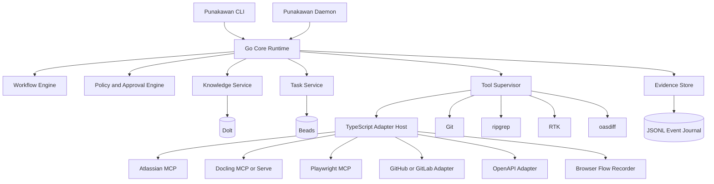
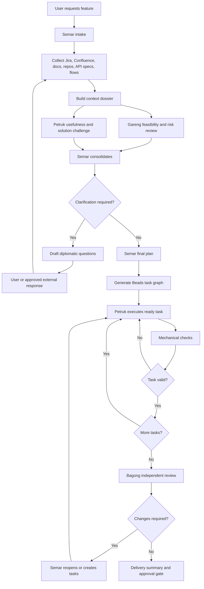

# Punakawan: Go Core + TypeScript Adapter Platform
## Detailed Engineering Plan

**Status:** Draft implementation plan  
**Primary objective:** Build a durable, safe, multi-repository agent platform that turns documents and requirements into verified knowledge, implementation plans, executable work items, code changes, tests, and evidence.  
**Core architecture:** Go runtime and supervisor, TypeScript adapter ecosystem, existing MCP/services for document parsing and enterprise integrations.

---

## 1. Product Vision

Punakawan is not a collection of four persona prompts. It is an engineering workflow that coordinates four distinct responsibilities:

- **Semar** assembles context, manages the workflow, resolves disagreements, and owns final synthesis.
- **Gareng** reviews clarity, feasibility, operational risk, security, compatibility, and missing constraints.
- **Petruk** challenges usefulness, proposes alternatives, plans implementation, and executes approved tasks.
- **Bagong** performs an independent final review against requirements, evidence, diffs, and tests.

The platform should:

1. Turn documents, tickets, specifications, repositories, and observed user flows into durable knowledge.
2. Preserve provenance for every extracted fact, assumption, decision, and relation.
3. Identify missing context and prepare diplomatic clarification questions for Jira or Confluence.
4. Produce a detailed implementation plan across multiple repositories.
5. Convert the approved plan into dependency-aware Beads tasks.
6. Execute tasks one by one in isolated Git worktrees.
7. Update unit, integration, API-contract, and E2E automation.
8. Review the final result independently and honestly.
9. Retain enough evidence to reproduce why a conclusion or code change was made.
10. Avoid rebuilding document parsers, Atlassian connectors, or browser automation infrastructure when mature tools already exist.

---

## 2. Guiding Principles

### 2.1 Orchestrate rather than reimplement

Reuse existing providers wherever possible:

- Docling MCP or Docling Serve for rich document conversion.
- Atlassian Rovo MCP for Jira and Confluence Cloud.
- Playwright MCP and Playwright Test for browser automation.
- Git for source history and worktrees.
- Dolt for versioned relational knowledge.
- Beads for the agent work graph.
- ripgrep for repository search.
- RTK for compact command output.
- oasdiff for OpenAPI compatibility checks.

Punakawan owns normalization, policy, provenance, workflow, review, and durable relations.

### 2.2 Durable knowledge before autonomous action

The agent must not plan directly from a temporary prompt context when the information can be stored and reviewed. Relevant findings become project-level knowledge with source references and validity state.

### 2.3 Evidence over confident prose

Every material conclusion should be traceable to one or more of:

- Source document section
- Jira issue or comment
- Confluence page version
- Git repository and commit
- Source file and symbol
- Recorded browser flow
- Test report
- API diff
- User clarification
- Explicit assumption

### 2.4 Explicit side-effect boundaries

Reading may be broadly allowed. External writes, Git pushes, issue transitions, page edits, and deployments require policy evaluation and usually approval.

### 2.5 Multi-repository first

A feature may be:

- Implemented in repository A
- Tested end-to-end in repository B
- Deployed from repository C
- Documented in Confluence
- Tracked in Jira

The knowledge model must support this naturally rather than treating repositories as isolated worlds.

### 2.6 Human-guided automation

Punakawan can ask the user to demonstrate an existing browser flow. It should record the semantic path, sanitize sensitive input, save it as durable project knowledge, and generate or adjust Playwright tests.

### 2.7 Conform to existing conventions before imposing defaults

A repository's existing code style, `.editorconfig`, linter/formatter configuration, and directory structure take precedence over Punakawan's own defaults. Punakawan must detect these conventions, store them as durable knowledge with provenance, and conform to them when implementing tasks. The same durable profile lets a reference repository serve as a style and structure baseline when scaffolding a new project (see §27).

---

## 3. High-Level Architecture



### 3.1 Go responsibilities

The Go core is the trusted runtime and process supervisor.

It owns:

- CLI and daemon lifecycle
- Workflow state machine
- Role orchestration
- Workspace discovery
- Process supervision
- Tool installation and verification
- Capability enforcement
- Approval gates
- Secret leasing
- Filesystem boundaries
- Git worktree lifecycle
- Workspace locking
- Durable event journal
- Knowledge and task service interfaces
- Adapter lifecycle
- Retry, timeout, cancellation, and cleanup
- Audit logging
- Recovery after interrupted runs

### 3.2 TypeScript responsibilities

TypeScript is the integration and browser ecosystem.

It owns:

- Adapter SDK
- MCP client and server integration
- Jira and Confluence normalization
- Docling result normalization
- Playwright MCP integration
- Human-guided browser recorder
- Locator and semantic path generation
- Playwright test generation
- OpenAPI parsing helpers
- GitHub and GitLab API adapters
- CI-provider adapters
- Third-party plugin developer experience

### 3.3 External processes

Heavy or specialized tools remain external:

- Docling Python service
- Dolt server or CLI
- Beads CLI
- Playwright browser processes
- Git
- ripgrep
- RTK
- oasdiff
- Optional Pandoc
- Optional container runtime

---

## 4. Repository Strategy

Use a monorepo initially, with strict language and package boundaries.

```text
punakawan/
├── go.work
├── go.mod
├── package.json
├── pnpm-workspace.yaml
├── Makefile
├── Taskfile.yml
├── README.md
├── LICENSE
├── SECURITY.md
├── CONTRIBUTING.md
├── docs/
│   ├── architecture/
│   ├── protocol/
│   ├── security/
│   ├── adapters/
│   └── workflows/
├── cmd/
│   ├── punakawan/
│   └── punakawand/
├── internal/
│   ├── app/
│   ├── workflow/
│   ├── roles/
│   │   ├── semar/
│   │   ├── gareng/
│   │   ├── petruk/
│   │   └── bagong/
│   ├── policy/
│   ├── approvals/
│   ├── workspace/
│   ├── knowledge/
│   ├── tasks/
│   ├── evidence/
│   ├── tools/
│   ├── adapters/
│   ├── gitops/
│   ├── secrets/
│   ├── audit/
│   └── recovery/
├── pkg/
│   ├── protocol/
│   ├── schemas/
│   └── sdk/
├── packages/
│   ├── adapter-sdk/
│   ├── adapter-host/
│   ├── schema-types/
│   ├── atlassian-adapter/
│   ├── docling-adapter/
│   ├── playwright-adapter/
│   ├── playwright-recorder/
│   ├── playwright-generator/
│   ├── openapi-adapter/
│   ├── github-adapter/
│   └── gitlab-adapter/
├── protocol/
│   ├── adapter.schema.json
│   ├── event.schema.json
│   ├── workflow.schema.json
│   ├── knowledge.schema.json
│   ├── task.schema.json
│   ├── evidence.schema.json
│   ├── approval.schema.json
│   └── flow.schema.json
├── prompts/
│   ├── semar/
│   ├── gareng/
│   ├── petruk/
│   └── bagong/
├── workflows/
│   ├── feature-delivery.yaml
│   ├── requirement-review.yaml
│   ├── browser-flow-capture.yaml
│   ├── implementation-only.yaml
│   └── final-review.yaml
├── toolchains/
│   ├── manifest.yaml
│   ├── checksums/
│   └── licenses/
├── examples/
│   ├── single-repository/
│   ├── multi-repository/
│   └── atlassian-playwright/
└── test/
    ├── integration/
    ├── contract/
    ├── e2e/
    └── fixtures/
```

### 4.1 Build orchestration

Use a root `Makefile` or `Taskfile.yml` to provide stable commands:

```bash
make bootstrap
make build
make test
make test-go
make test-ts
make lint
make generate
make protocol-check
make integration-test
make package
make doctor
```

The build must avoid rebuilding everything unnecessarily:

- Go packages use native incremental compilation.
- pnpm workspace filters build only affected packages.
- CI uses path filters and dependency graph calculation.
- Protocol schema changes trigger both Go and TypeScript code generation.
- Adapter-only changes do not rebuild unrelated adapters.
- Documentation-only changes skip binary builds.

---

## 5. Protocol Boundary Between Go and TypeScript

Use a language-neutral protocol generated from JSON Schema.

### 5.1 Transport

Support:

1. **stdio JSON-RPC** for local adapters.
2. **HTTP streaming** for remote adapters.
3. **MCP** for compatible providers.
4. **Unix domain sockets** or named pipes for local daemon mode.
5. Optional **gRPC** only if future performance measurements justify it.

The first implementation should use JSON-RPC over stdio because it is easy to inspect, test, and isolate.

### 5.2 Adapter lifecycle

```text
Go Core
  ├── starts adapter process
  ├── sends initialize
  ├── validates manifest
  ├── grants capabilities
  ├── executes operation
  ├── receives structured result
  ├── records evidence and events
  └── stops or reuses adapter
```

### 5.3 Required adapter messages

```text
initialize
health
capabilities
execute
cancel
shutdown
event
evidence
approval_request
```

### 5.4 Example adapter manifest

```yaml
id: atlassian-cloud
name: Atlassian Cloud Adapter
version: 0.1.0
protocol: punakawan.adapter/v1
runtime: node

provides:
  - knowledge-source
  - issue-tracker
  - documentation-system

permissions:
  network:
    hosts:
      - "*.atlassian.net"
  filesystem:
    read: []
    write: []
  secrets:
    - ATLASSIAN_ACCESS_TOKEN

operations:
  jira.search:
    side_effect: false
  jira.read:
    side_effect: false
  jira.create:
    side_effect: true
    approval: required
  jira.comment:
    side_effect: true
    approval: required
  confluence.read:
    side_effect: false
  confluence.update:
    side_effect: true
    approval: required
```

### 5.5 Schema generation

The JSON Schema files are canonical.

Generate:

- Go structs and validation helpers
- TypeScript interfaces and Zod validators
- Protocol documentation
- Compatibility tests
- Example payloads

CI must reject changes where generated code is stale.

---

## 6. Workspace Model

A Punakawan workspace groups repositories, external systems, and project-level durable knowledge.

```yaml
version: punakawan.workspace/v1
id: checkout-platform
name: Checkout Platform

repositories:
  - id: checkout-api
    path: ./checkout-api
    roles:
      - implementation
      - api-provider

  - id: checkout-e2e
    path: ./checkout-e2e
    roles:
      - e2e-tests

  - id: checkout-deployment
    path: ./checkout-deployment
    roles:
      - deployment
      - configuration

relations:
  - from: checkout-e2e
    type: tests
    to: checkout-api

  - from: checkout-deployment
    type: deploys
    to: checkout-api

external:
  jira:
    project: PAY
  confluence:
    spaces:
      - CHECKOUT

knowledge:
  store: dolt
  database: .punakawan/knowledge

tasks:
  provider: beads
  path: .punakawan/tasks

policy:
  file: .punakawan/policy.yaml
```

### 6.1 Project directory

```text
.punakawan/
├── workspace.yaml
├── policy.yaml
├── knowledge/
├── tasks/
├── flows/
├── evidence/
├── runs/
├── cache/
├── approvals/
└── generated/
```

### 6.2 Stable identifiers

Use stable workspace-level URIs:

```text
pkw:req/checkout-platform/REQ-2026-0182
pkw:decision/checkout-platform/ADR-0041
pkw:flow/checkout-platform/refund-approved-order
pkw:repo/checkout-platform/checkout-api
pkw:task/checkout-platform/bd-a8f3
pkw:evidence/checkout-platform/run-20260720-001
```

Do not use file paths as the only identity.

---

## 7. Durable Knowledge Model

Use Dolt as the canonical relational knowledge store. Use Git-tracked YAML and JSONL as portable project artifacts and append-only evidence.

### 7.1 Core entities

- Workspace
- Repository
- Component
- ConventionProfile
- SourceArtifact
- Requirement
- AcceptanceCriterion
- Claim
- Assumption
- Constraint
- Decision
- Question
- Answer
- APIContract
- DataContract
- BrowserFlow
- TestCase
- DeploymentUnit
- WorkItem
- ChangeSet
- Evidence
- ExternalReference
- Person or Team
- Risk
- ReviewFinding

### 7.2 Core relations

- `DERIVED_FROM`
- `SUPERSEDES`
- `IMPLEMENTS`
- `VALIDATES`
- `TESTED_BY`
- `AUTOMATED_BY`
- `DEPLOYED_BY`
- `DEPENDS_ON`
- `BLOCKS`
- `RELATED_TO`
- `CONFLICTS_WITH`
- `OWNED_BY`
- `APPLIES_TO`
- `VERIFIED_BY`
- `DISCOVERED_FROM`
- `DOCUMENTED_IN`
- `TRACKED_BY`
- `OBSERVED_IN`
- `ASSUMES`
- `RESOLVES`

### 7.3 Required provenance fields

Every durable knowledge record must contain:

```yaml
id: pkw:req/checkout-platform/REQ-2026-0182
type: requirement
status: active
title: Refund approved order

source:
  provider: jira
  external_id: PAY-1842
  version: 7
  uri: jira://PAY-1842
  section: description
  content_hash: sha256:...
  retrieved_at: 2026-07-20T04:00:00Z

extraction:
  method: model-assisted
  extractor_version: 0.1.0
  confidence: 0.88

validity:
  state: verified
  verified_by:
    - user
  verified_at: 2026-07-20T04:05:00Z
```

### 7.4 Knowledge states

- `observed`
- `inferred`
- `assumed`
- `verified`
- `disputed`
- `superseded`
- `invalid`
- `stale`

Semar must not silently promote inferred knowledge to verified fact.

### 7.5 JSONL use

Use JSONL for:

- Run event journals
- Adapter events
- Raw browser recordings
- Model invocation metadata
- Command execution records
- Recovery checkpoints
- Import and export
- Human-readable debugging

JSONL is not the canonical relation graph.

---

## 8. Role Architecture

Each role is a workflow module with a strict input and output contract.

### 8.1 Semar

Responsibilities:

- Interpret user intent
- Identify workspace and affected systems
- Collect context from repositories, Jira, Confluence, documents, API specs, and browser flows
- Build a context dossier
- Separate fact, inference, assumption, and uncertainty
- Decide which roles and tools to invoke
- Merge Gareng and Petruk findings
- Generate diplomatic clarification questions
- Define the final implementation plan
- Convert the plan to work items
- Resolve Bagong findings into reopen, block, or follow-up decisions

Semar output:

```yaml
goal:
scope:
known_facts:
assumptions:
open_questions:
affected_repositories:
affected_components:
risks:
recommended_workflow:
next_gate:
```

### 8.2 Gareng

Responsibilities:

- Requirement completeness
- Feasibility
- Compatibility
- Security
- Privacy
- Reliability
- Performance
- Operational impact
- Migration
- Rollback
- Observability
- Testability
- Failure modes
- Acceptance-criteria quality

Gareng output:

```yaml
verdict: clarification_required
blocking_findings:
non_blocking_findings:
missing_acceptance_criteria:
risks:
recommended_defaults:
required_evidence:
```

### 8.3 Petruk

Responsibilities:

- User-centric challenge
- Simpler alternatives
- Architecture options
- Scope reduction
- Avoiding overengineering
- Implementation planning
- Task execution
- Unit and integration test updates
- E2E adjustments
- Documentation changes
- Discovery of follow-up tasks
- Scaffolding new projects from a reference repository's convention profile

Petruk planning output:

```yaml
recommended_solution:
alternatives:
tradeoffs:
implementation_steps:
repository_changes:
test_plan:
e2e_plan:
deployment_plan:
documentation_plan:
```

Petruk execution output:

```yaml
task:
status:
changed_files:
commands:
tests:
evidence:
discovered_tasks:
remaining_risks:
commit:
```

### 8.4 Bagong

Responsibilities:

- Independent requirement review
- Diff review
- Test evidence review
- API compatibility review
- Migration review
- E2E flow comparison
- Unresolved task review
- Honest confidence statement
- Detection of missing or cosmetic-only implementation

Bagong output:

```yaml
verdict: changes_required
requirement_coverage:
findings:
test_gaps:
security_findings:
compatibility_findings:
uncertainties:
honest_summary:
```

Bagong must receive raw evidence, not only Petruk’s summary.

---

## 9. End-to-End Feature Workflow



### 9.1 Context dossier

Before planning, Semar must produce:

- User goal
- Business or user value
- Current behavior
- Desired behavior
- Explicit non-goals
- Source inventory
- Affected repositories
- Existing implementation paths
- Existing tests
- API and data contracts
- Deployment path
- Relevant previous decisions
- Assumptions
- Missing information
- Contradictions
- Confidence level

### 9.2 Clarification gate

Each question must include:

```yaml
question:
why_it_matters:
observed_conflict:
recommended_default:
impact_if_unanswered:
blocking: true
target:
  system: jira
  reference: PAY-1842
```

External publication requires approval unless policy explicitly allows it.

### 9.3 Final plan

The final plan must contain:

- Requirements
- Acceptance criteria
- Non-goals
- Architecture decision
- Data-model impact
- API impact
- Repository impact map
- Implementation sequence
- Unit-test plan
- Integration-test plan
- E2E plan
- Migration plan
- Rollback plan
- Observability plan
- Documentation plan
- Deployment changes
- Security considerations
- Compatibility considerations
- Verification criteria
- Risks and mitigations

---

## 10. Beads Task Generation

Jira remains the human-facing tracker. Beads becomes the detailed local execution graph.

### 10.1 Mapping

```yaml
requirement_id: pkw:req/checkout-platform/REQ-2026-0182
jira_key: PAY-1842
beads_epic: bd-a8f3
```

### 10.2 Task graph example

```text
Feature epic
├── Confirm data model
├── Create database migration
│   └── blocks API implementation
├── Implement API behavior
│   ├── requires unit tests
│   └── blocks integration tests
├── Update OpenAPI specification
│   └── blocks client compatibility check
├── Update E2E automation repository
├── Update deployment configuration
├── Update documentation
└── Final independent review
```

### 10.3 Task contract

Every task must include:

- Stable task ID
- Parent requirement
- Affected repository
- Dependencies
- Scope
- Expected files or components
- Acceptance criteria
- Test requirements
- Required evidence
- Risk classification
- Approval requirements
- Definition of done

### 10.4 Discovery rule

Petruk must not silently increase scope. Newly discovered work becomes a `discovered-from` task and is reviewed by Semar.

---

## 11. Petruk Execution Runtime

### 11.1 Worktree isolation

For every implementation task:

1. Acquire workspace lock.
2. Confirm clean base repository.
3. Create a dedicated Git worktree.
4. Create or switch to a task branch.
5. Load only relevant knowledge.
6. Execute the smallest valid change.
7. Run targeted checks.
8. Record evidence.
9. Commit or mark blocked.
10. Release the worktree.

Example:

```text
.punakawan/worktrees/
└── checkout-api/
    └── bd-a8f3/
```

### 11.2 Fresh context per task

Each task execution receives a fresh context containing:

- Task definition
- Parent requirement
- Relevant source excerpts
- Related decisions
- Affected symbols and files
- Required tests
- Previous task outputs
- Known constraints

Avoid carrying a long conversational history across all tasks.

### 11.3 Execution loop

```text
claim task
inspect repository
identify minimal change
edit
format
compile
run targeted tests
inspect diff
run policy checks
record evidence
commit
close or block task
```

### 11.4 Command supervision

The Go supervisor must enforce:

- Explicit executable and argument arrays
- No shell string concatenation by default
- Working-directory allowlist
- Environment allowlist
- Secret leases
- Timeout
- Maximum output size
- CPU and memory policy where supported
- Network policy where supported
- Process-tree termination
- Signal forwarding
- Full raw log retention
- RTK-compressed model-facing output

---

## 12. Playwright Human-Guided Flow Recorder

### 12.1 Objective

Allow Punakawan to ask a user to demonstrate a browser flow, record the semantic interaction path, sanitize sensitive data, store it as durable project knowledge, and generate or update Playwright tests.

### 12.2 Browser modes

#### Controlled browser

Recommended default:

- Punakawan launches a headed browser.
- Uses a dedicated persistent profile.
- User signs in and performs the flow.
- Recorder visibly indicates active recording.

#### Existing browser

Optional:

- Connect through a supported Playwright browser extension or remote debugging session.
- User explicitly selects the tab.
- Broader session access requires stronger approval.

### 12.3 Recorder architecture

```text
Go Core
  ↓
TypeScript Playwright Adapter
  ↓
Playwright MCP or direct Playwright API
  ↓
Injected recorder script
  ↓
Browser page and frames
```

### 12.4 Recorded event types

Browser-side:

- Click
- Fill
- Select
- Check or uncheck
- Submit
- Meaningful keyboard action
- History push or replace
- Popstate
- Hash change

Host-side:

- Navigation
- Popup or new tab
- Dialog
- Download
- File chooser
- Console error
- Request failure
- Page close

### 12.5 Semantic locator priority

1. Test ID
2. Role and accessible name
3. Label
4. Placeholder
5. Stable text
6. Stable attributes
7. Scoped CSS
8. XPath only as diagnostic fallback

Each saved locator should include several candidates and uniqueness verification.

### 12.6 Sensitive input policy

Never record raw:

- Passwords
- OTPs
- API tokens
- Session tokens
- Card numbers
- Hidden inputs
- Secret query parameters

Store parameter placeholders:

```yaml
value:
  kind: secret
  parameter: USER_PASSWORD
  recorded: false
```

### 12.7 Recorder controls

Provide an in-browser overlay:

- Pause
- Resume
- Mark next field as secret
- Ignore next action
- Add assertion
- Add note
- Mark checkpoint
- Finish flow

### 12.8 Storage layout

```text
.punakawan/flows/refund-approved-order/
├── events.jsonl
├── flow.yaml
├── assertions.yaml
├── metadata.yaml
├── screenshots/
├── traces/
└── generated/
    └── refund-approved-order.spec.ts
```

### 12.9 Semantic flow example

```yaml
id: pkw:flow/checkout-platform/refund-approved-order
name: Refund an approved order
version: 1

purpose:
  actor: customer
  goal: request a refund

preconditions:
  - authenticated user
  - refundable order exists

steps:
  - id: open-orders
    action: navigate
    route: /orders

  - id: select-order
    action: click
    target:
      role: link
      name_pattern: "Order {orderId}"

  - id: request-refund
    action: click
    target:
      role: button
      name: Request refund

  - id: fill-reason
    action: fill
    target:
      label: Reason
    value:
      parameter: refundReason

  - id: submit
    action: click
    target:
      role: button
      name: Submit refund

expected:
  - type: text_visible
    value: Refund requested

relations:
  - type: validates
    target: pkw:req/checkout-platform/REQ-2026-0182
  - type: automated-by
    target: pkw:repo/checkout-platform/checkout-e2e
```

### 12.10 Current versus desired behavior

Recorded flows represent observed behavior, not automatically correct behavior.

```yaml
observed_behavior:
  source: pkw:flow/checkout-platform/refund-approved-order

required_behavior:
  source: pkw:req/checkout-platform/REQ-2026-0182

difference:
  classification: intentional-change
```

---

## 13. Existing Integrations

### 13.1 Docling

Use Docling MCP or Docling Serve.

Punakawan responsibilities:

- Submit files or URLs
- Receive structured document output
- Split into source-preserving sections
- Normalize tables, headings, and metadata
- Extract candidate requirements, constraints, claims, and decisions
- Preserve page and section provenance
- Track parser version and content hash
- Flag uncertain extraction
- Avoid embedding-only storage as the source of truth

### 13.2 Jira and Confluence

Use official Atlassian MCP for Cloud where possible.

Punakawan responsibilities:

- Normalize Jira issues and Confluence pages
- Preserve external IDs and versions
- Draft clarification comments
- Apply policy before writes
- Link external records to internal knowledge
- Detect stale cached content
- Record write evidence
- Reconcile changed versions

Fallback adapters may be required for Data Center deployments.

### 13.3 GitHub and GitLab

Capabilities:

- Repository metadata
- Pull requests or merge requests
- Issues
- CI status
- Branch protection awareness
- Draft PR creation
- Review comments
- Changed-file inventory

Push and PR creation require approval by default.

### 13.4 OpenAPI

Use parser libraries plus oasdiff.

Capabilities:

- Parse specifications
- Discover operations
- Link operations to source handlers
- Compare base and head
- Detect breaking changes
- Generate compatibility evidence
- Map operations to E2E flows and requirements

### 13.5 Repository convention extraction

Detect a repository's existing conventions rather than assuming Punakawan's own defaults apply. See §27 for the full design.

Capabilities:

- Detect `.editorconfig`, linter and formatter configuration (ESLint, Prettier, golangci-lint, gofmt, stylelint, rustfmt, and equivalents)
- Detect directory layout and naming patterns
- Detect package manager and build tooling in use
- Normalize findings into a `ConventionProfile` knowledge record with provenance
- Reuse a `ConventionProfile` as a baseline when scaffolding a new project

---

## 14. Toolchain Management

### 14.1 Managed tools

```text
git
rg
rtk
bd
dolt
oasdiff
node
playwright
docling
pandoc optional
```

### 14.2 Installation profiles

```text
minimal
  punakawan + git + rg

developer
  minimal + rtk + beads + dolt + oasdiff

documents
  developer + docling + optional pandoc

browser
  developer + node + playwright browsers

full
  all supported tools
```

### 14.3 Manifest

```yaml
tools:
  ripgrep:
    version: pinned
    required: true
    checksum: ...
    license: MIT

  rtk:
    version: pinned
    required: false
    checksum: ...

  beads:
    version: pinned
    required: false
    checksum: ...

  dolt:
    version: pinned
    required: false
    checksum: ...

  oasdiff:
    version: pinned
    required: false
    checksum: ...
```

### 14.4 CLI

```bash
punakawan tools doctor
punakawan tools install developer
punakawan tools verify
punakawan tools list
punakawan tools licenses
punakawan tools update --dry-run
```

Large browser binaries and document models should be installed on demand.

---

## 15. Security Model

### 15.1 Capability policy

```yaml
capabilities:
  filesystem:
    read:
      - workspace/**
    write:
      - workspace/**
    deny:
      - "**/.env"
      - "**/.ssh/**"
      - "**/secrets/**"

  git:
    commit: allowed
    push: approval
    force_push: denied
    default_branch_write: denied

  external:
    jira_read: allowed
    jira_write: approval
    confluence_read: allowed
    confluence_write: approval

  browser:
    controlled_profile: allowed
    existing_profile: approval
    record_inputs: sanitized

  execution:
    network: restricted
    timeout_seconds: 600
    max_output_bytes: 1000000
```

### 15.2 Secret broker

Adapters should request named secrets from the Go core.

```text
adapter requests secret
  ↓
policy checks adapter identity and operation
  ↓
short-lived secret lease issued
  ↓
secret injected only into child process or request
  ↓
lease expires
```

Secrets must not be included in model context, JSONL logs, or evidence bundles.

### 15.3 Prompt injection defense

External content is untrusted.

Requirements:

- Mark every external document as untrusted input.
- Separate instructions from evidence.
- Do not execute commands found in documents.
- Do not grant capabilities based on document content.
- Require explicit workflow policy for writes.
- Preserve the source of suspicious instructions.
- Allow Gareng and Bagong to flag injection attempts.

### 15.4 Git safety

- No direct edits on the default branch.
- No force push by default.
- No destructive reset without approval.
- Verify repository root before writing.
- Prevent path traversal.
- Require clean or explicitly isolated worktrees.
- Record base commit and resulting commit.
- Block commits containing detected secrets.

### 15.5 Browser safety

- Visible recording indicator.
- Explicit user start and stop.
- Sensitive-field masking.
- URL query sanitization.
- No hidden background capture.
- Existing-profile access requires explicit approval.
- Store screenshots and traces according to retention policy.

---

## 16. Approval Model

### 16.1 Approval categories

- External write
- Git push
- Pull request creation
- Issue creation
- Issue transition
- Confluence update
- Existing-browser session access
- Secret access
- Network host expansion
- Destructive filesystem action
- Deployment action

### 16.2 Approval record

```yaml
id: approval-20260720-001
run_id: run-20260720-004
operation: jira.comment
target: PAY-1842
reason: requirement clarification
requested_by: semar
preview: |
  The requirement does not define retry behavior...
status: approved
approved_by: user
created_at: ...
resolved_at: ...
```

### 16.3 Policy levels

- `deny`
- `require-approval`
- `allow`
- `allow-with-constraints`

---

## 17. Evidence and Audit

### 17.1 Evidence types

- Source excerpt
- Repository snapshot
- Command output
- Test report
- Playwright trace
- Screenshot
- API diff
- Git diff
- Commit
- User answer
- Approval record
- Jira or Confluence response
- Review finding

### 17.2 Evidence bundle

Each task completion should create:

```text
.punakawan/evidence/run-20260720-004/bd-a8f3/
├── task.yaml
├── commands.jsonl
├── diff.patch
├── tests.json
├── logs/
├── screenshots/
├── traces/
├── api-diff.json
├── provenance.yaml
└── summary.yaml
```

### 17.3 Audit requirements

Record:

- Who or what initiated the action
- Role
- Tool
- Arguments with secrets redacted
- Working directory
- Start and end time
- Exit status
- Result hash
- Approval reference
- Knowledge records changed
- Tasks changed
- Git commits produced

---

## 18. Reliability and Recovery

### 18.1 Run state machine

```text
created
context-building
awaiting-clarification
planning
awaiting-approval
executing
reviewing
blocked
completed
failed
cancelled
```

### 18.2 Recovery

On restart:

1. Load last durable checkpoint.
2. Inspect child-process state.
3. Verify worktree state.
4. Verify task state.
5. Reconcile uncommitted changes.
6. Mark interrupted operations.
7. Resume only idempotent steps automatically.
8. Require approval for uncertain external side effects.

### 18.3 Idempotency

Every external write request should include an operation key where supported.

Punakawan should store:

- Request fingerprint
- External response ID
- Completion state
- Retry count

---

## 19. Observability

### 19.1 Structured logging

Fields:

- Run ID
- Workflow
- Role
- Workspace
- Repository
- Task
- Adapter
- Tool
- Operation
- Duration
- Result
- Approval ID

### 19.2 Metrics

- Runs started and completed
- Task success rate
- Clarification frequency
- Average context-build duration
- Adapter failure count
- Tool timeout count
- Approval wait count
- Knowledge records created
- Stale knowledge count
- Bagong rejection rate
- Test pass rate
- Token and model cost where available

### 19.3 Tracing

Use OpenTelemetry-compatible traces across:

- Go workflow span
- Adapter invocation
- MCP call
- External service request
- Tool process
- Test run

---

## 20. Testing Strategy

### 20.1 Go tests

- Workflow state transitions
- Policy evaluation
- Process supervision
- Cancellation
- Timeout behavior
- Workspace locking
- Git worktree lifecycle
- Knowledge service
- Beads integration
- Recovery
- Audit records
- Secret leasing

### 20.2 TypeScript tests

- Adapter contract validation
- Atlassian normalization
- Docling normalization
- Playwright locator generation
- Recorder event capture
- Sensitive data sanitization
- Flow normalization
- Playwright test generation
- MCP compatibility
- OpenAPI parsing

### 20.3 Contract tests

Every adapter must pass:

- Initialize
- Capability declaration
- Health
- Successful operation
- Validation failure
- Timeout
- Cancellation
- Approval request
- Evidence emission
- Graceful shutdown

### 20.4 Integration tests

Use controlled fixtures:

- Local Git repositories
- Fake Jira and Confluence MCP
- Fake Docling service
- Local Dolt
- Local Beads project
- Sample OpenAPI specs
- Sample browser application
- Multi-repository workspace

### 20.5 E2E tests

Scenarios:

1. Import requirement from Jira.
2. Import supporting Confluence page.
3. Inspect three repositories.
4. Record a browser flow.
5. Generate clarification.
6. Approve final plan.
7. Generate Beads tasks.
8. Execute implementation task in worktree.
9. Update E2E repository.
10. Run Bagong review.
11. Produce evidence bundle.

---

## 21. CI/CD Plan

### 21.1 Pull request checks

- Go format
- Go vet
- Go unit tests
- TypeScript lint
- TypeScript typecheck
- TypeScript unit tests
- Schema generation check
- Protocol compatibility check
- Adapter contract tests
- License scan
- Dependency review
- Secret scan
- Build affected packages
- Multi-platform smoke build

### 21.2 Release artifacts

- Go CLI binaries
- Go daemon binaries
- npm packages for adapter SDK
- npm packages for official adapters
- Tool manifest
- Checksums
- SBOM
- License report
- Container image optional
- Example workspace bundle

### 21.3 Versioning

Use semantic versioning.

Version separately:

- Core runtime
- Protocol
- Adapter SDK
- Official adapters
- Workflow definitions

The core declares supported protocol ranges.

---

## 22. Milestone Plan

## Milestone 0: Architecture and protocol foundation

Deliverables:

- Repository scaffolding
- Go and pnpm workspaces
- Canonical JSON Schemas
- Generated Go and TypeScript types
- JSON-RPC stdio prototype
- Adapter manifest format
- Architecture decision records
- Threat model
- Basic CI

Acceptance criteria:

- Go can start a TypeScript adapter.
- Both sides validate the same message schemas.
- Cancellation and timeout work.
- CI detects stale generated code.

---

## Milestone 1: Core runtime and local repository workflow

Deliverables:

- CLI
- Workspace discovery
- Policy engine
- Approval storage
- Tool supervisor
- Git repository inspection
- Worktree lifecycle
- JSONL event journal
- Evidence bundle skeleton
- ripgrep integration
- RTK integration

Acceptance criteria:

- Punakawan opens a workspace with multiple repositories.
- It can inspect repositories without writing.
- It can create an isolated worktree after approval.
- Every command is auditable and cancellable.
- Default-branch writes are blocked.

---

## Milestone 2: Knowledge and task foundation

Deliverables:

- Dolt knowledge schema
- Knowledge service
- Provenance model
- Beads integration
- Requirement-to-task mapping
- Cross-repository relations
- Knowledge import and export
- Staleness detection
- Repository convention profile extraction

Acceptance criteria:

- A requirement can link to files and tests across repositories.
- Every relation retains source provenance.
- Beads tasks map back to requirements and Jira keys.
- Knowledge changes can be diffed and versioned.
- A repository's editorconfig, formatter/linter config, and directory conventions are captured as a `ConventionProfile` with provenance.

---

## Milestone 3: Semar, Gareng, and Petruk planning workflow

Deliverables:

- Role contracts
- Prompt templates
- Context dossier generation
- Gareng review
- Petruk challenge
- Semar clarification synthesis
- Final implementation plan schema
- Workflow checkpoints

Acceptance criteria:

- A feature request produces a structured context dossier.
- Missing information is classified as blocking or non-blocking.
- Clarification wording is diplomatic and evidence-backed.
- The final plan includes unit, integration, E2E, deployment, and documentation impact.

---

## Milestone 4: Existing document and Atlassian integrations

Deliverables:

- Docling adapter
- Atlassian adapter
- Jira search and read
- Confluence search and read
- Draft comment generation
- Approval-gated Jira and Confluence writes
- Source version reconciliation

Acceptance criteria:

- Punakawan imports a Jira issue and supporting Confluence page.
- Extracted knowledge preserves page, section, version, and hash.
- It detects when a source version changes.
- External writes cannot occur without policy approval.

---

## Milestone 5: Playwright human-guided recorder

Deliverables:

- Playwright adapter
- Controlled headed-browser mode
- Recorder injection
- Visible recorder overlay
- Navigation and interaction capture
- Semantic locator generation
- Sensitive-input sanitizer
- JSONL raw recording
- YAML normalized flow
- Screenshot and trace evidence

Acceptance criteria:

- A user can demonstrate a flow.
- Punakawan stores URLs, clicks, and sanitized inputs.
- Passwords and tokens are never stored.
- The normalized flow survives minor DOM layout changes.
- The flow can link to a requirement and E2E repository.

---

## Milestone 6: Plan-to-Beads and Petruk execution

Deliverables:

- Task graph generator
- Ready-task selection
- Fresh context per task
- Worktree executor
- File editing abstraction
- Bulk file creation
- Diff checker
- Unit and integration test execution
- OpenAPI compatibility check
- Commit creation
- Discovered-task handling

Acceptance criteria:

- An approved plan becomes dependency-aware tasks.
- Petruk executes only ready tasks.
- Each task has isolated changes and evidence.
- Scope expansion becomes a new task.
- Failed checks prevent task completion.

---

## Milestone 7: Playwright test generation and adjustment

Deliverables:

- Flow-to-Playwright compiler
- Parameterization
- Fixture integration
- Assertion generation
- Existing-test matching
- Test update planning
- E2E repository worktree execution

Acceptance criteria:

- A recorded flow generates a valid Playwright test.
- Existing tests can be updated rather than duplicated.
- Generated tests use semantic locators.
- Test reports and traces become evidence.

---

## Milestone 8: Bagong independent review

Deliverables:

- Independent context builder
- Requirement coverage analysis
- Diff review
- Test evidence review
- API compatibility review
- Migration review
- E2E behavior review
- Finding severity model
- Reopen-task workflow

Acceptance criteria:

- Bagong reviews raw sources and diffs independently.
- Missing acceptance criteria are visible.
- High-severity findings reopen or create tasks.
- Delivery cannot be marked complete with unresolved blocking findings.

---

## Milestone 9: Hardening and release

Deliverables:

- Recovery after interruption
- Adapter sandboxing
- Secret broker
- Tool installer
- Tool checksums and licenses
- OpenTelemetry
- SBOM
- Signed release artifacts
- Multi-platform packaging
- Documentation and examples

Acceptance criteria:

- Interrupted runs recover safely.
- Orphan child processes are terminated.
- Tool binaries are checksum-verified.
- Secrets are excluded from logs and evidence.
- Release artifacts work on supported platforms.

---

## 23. MVP Scope

The first useful release should include:

- Go CLI and supervisor
- TypeScript adapter host and SDK
- Multi-repository workspace
- Git and worktree management
- Dolt knowledge
- Beads task graph
- JSONL event journal
- Semar, Gareng, Petruk, and Bagong workflow
- Jira and Confluence read integration
- Draft clarification output
- Docling document ingestion
- Controlled Playwright flow recording
- Basic Playwright test generation
- OpenAPI diff
- Approval-gated external writes
- Evidence bundles
- Repository convention profile extraction (style/structure baseline reuse for new-project scaffolding)

Do not include initially:

- Automatic deployment
- Unattended production browser access
- Marketplace for arbitrary untrusted plugins
- Full IDE
- Custom document parser
- Custom issue tracker database
- Custom browser engine
- Autonomous force push
- Automatic Jira transitions without approval
- General-purpose vector database as the canonical truth store

---

## 24. Key Risks and Mitigations

### Risk: Too many integrations before a working vertical slice

Mitigation:

- Implement one end-to-end example first.
- Use Jira, Confluence, one API repository, one E2E repository, and one deployment repository.
- Defer additional providers.

### Risk: Protocol churn between Go and TypeScript

Mitigation:

- Canonical JSON Schema.
- Generated types.
- Compatibility tests.
- Versioned protocol.
- Small initial message surface.

### Risk: Agent-generated knowledge becomes stale or false

Mitigation:

- Provenance.
- Validity state.
- Source version.
- Content hash.
- Explicit verification.
- Staleness checks.
- Bagong review.

### Risk: Browser recorder captures sensitive data

Mitigation:

- Field classification.
- Secret masking.
- Visible recording controls.
- Existing-profile approval.
- Sanitized URLs.
- Retention policy.

### Risk: External MCP tool behavior changes

Mitigation:

- Adapter normalization.
- Capability probing.
- Provider version recording.
- Contract tests.
- Graceful degradation.
- Fallback interfaces.

### Risk: Autonomous code changes damage repositories

Mitigation:

- Worktrees.
- No default-branch writes.
- Approval gates.
- Targeted tests.
- Diff review.
- Secret scan.
- Bagong final review.

### Risk: Go core becomes a duplicate business-logic implementation

Mitigation:

- Keep browser and integration logic in TypeScript.
- Keep Go focused on trusted orchestration, policy, process, workspace, and recovery.
- Share schemas rather than duplicating domain behavior.

---

## 25. Initial Technical Decisions

1. **Go owns the trusted runtime.**
2. **TypeScript owns adapters, MCP integrations, and browser automation.**
3. **JSON Schema is the canonical cross-language contract.**
4. **JSON-RPC over stdio is the first adapter transport.**
5. **Dolt is the canonical knowledge store.**
6. **Beads is the execution task graph.**
7. **JSONL is the event and raw evidence format.**
8. **Git-tracked YAML stores portable, human-reviewable project knowledge.**
9. **Docling is reused for document parsing.**
10. **Atlassian MCP is reused for Jira and Confluence Cloud.**
11. **Playwright MCP or direct Playwright APIs are reused for browser control.**
12. **The Punakawan recorder is custom and injected visibly.**
13. **External writes require approval by default.**
14. **Petruk works one isolated task at a time.**
15. **Bagong reviews raw evidence independently.**

---

## 26. Definition of Success

Punakawan is successful when the following scenario works reliably:

1. A user gives a Jira feature request.
2. Semar retrieves Jira, Confluence, relevant documents, and repository context.
3. Semar links implementation, E2E, and deployment repositories.
4. Gareng identifies missing feasibility, security, and operational details.
5. Petruk challenges whether the proposed solution is useful and appropriately scoped.
6. Semar drafts diplomatic clarification questions.
7. The user resolves the questions.
8. Semar creates a final implementation and test plan.
9. The plan becomes a Beads task graph.
10. The user demonstrates the current browser flow.
11. Punakawan stores the semantic path in durable project knowledge.
12. Petruk implements each task in isolated worktrees.
13. Unit, integration, OpenAPI, and Playwright checks run.
14. Bagong independently compares requirements, plan, diffs, tests, and browser evidence.
15. Punakawan reports an honest final verdict and preserves a reproducible evidence bundle.

That is the first complete Punakawan experience. Everything else is expansion, polish, or another opportunity for a dependency to publish a breaking minor release.

---

## 27. Repository Convention Learning and Baseline Scaffolding

### 27.1 Objective

Punakawan must not impose its own defaults onto a repository that already has established conventions. It should detect those conventions, store them as durable, provenance-backed knowledge, and conform to them for every task executed in that repository. The same durable record lets a reference repository act as a style and structure baseline when scaffolding an unrelated new project.

### 27.2 Convention sources detected

- `.editorconfig`
- Formatter configuration (Prettier, gofmt, `go fmt` settings, rustfmt, black/ruff, clang-format)
- Linter configuration (ESLint, golangci-lint, stylelint, and equivalents)
- Directory layout and naming patterns (derived from the existing tree, not assumed)
- Package manager and build tooling already in use (npm/pnpm/yarn, go.work vs single module, Makefile vs Taskfile)
- License header conventions, if present

### 27.3 ConventionProfile knowledge record

Follows the same provenance model as §7.3.

```yaml
id: pkw:convention/checkout-platform/checkout-api
type: convention-profile
status: active
title: checkout-api convention profile

source:
  provider: git
  external_id: checkout-api@main
  version: <commit-sha>
  uri: repo://checkout-api
  retrieved_at: 2026-07-20T04:00:00Z

extraction:
  method: model-assisted
  extractor_version: 0.1.0
  confidence: 0.9

validity:
  state: observed

formatting:
  editorconfig: true
  linters: [eslint, golangci-lint]
  formatters: [prettier, gofmt]

structure:
  layout: monorepo
  package_manager: pnpm
  test_framework: [go test, vitest]
  naming_convention: kebab-case-dirs
```

### 27.4 Detection method and confidence

- Explicit configuration files (`.editorconfig`, `.eslintrc*`, `.prettierrc*`, `.golangci.yml`) are recorded with `validity.state: observed` and high confidence.
- Patterns inferred from repository structure without an explicit config file (e.g. consistent kebab-case directory naming with no documented rule) are recorded with `validity.state: inferred` and a lower confidence score, per §7.4.
- A `ConventionProfile` is revalidated when the source commit changes, following the same staleness detection as other knowledge (§7, Milestone 2).

### 27.5 Applying a profile during implementation

When Petruk executes a task in a repository with an existing `ConventionProfile`, that profile's formatting and structural conventions take precedence over Punakawan's own defaults. Gareng may flag a task whose plan would deviate from the profile without justification.

### 27.6 Baseline scaffolding workflow

To scaffold a new project from a reference repository:

1. Extract or load the reference repository's `ConventionProfile`.
2. Apply its structure (layout, naming, package manager, build tooling) to the new project's initial scaffold.
3. Apply its formatting and linter configuration.
4. Record the new project's `ConventionProfile` with a `derived-from` relation (§7.2) pointing to the reference repository's profile.

### 27.7 What is not copied

Baseline scaffolding reuses conventions, not content. It must not copy:

- Secrets or credentials
- Proprietary or repository-specific business logic
- License-incompatible code
- Anything the reference repository's license does not permit reusing

Only structural and stylistic conventions (layout, naming, formatting, tooling choices) transfer to the new project.
