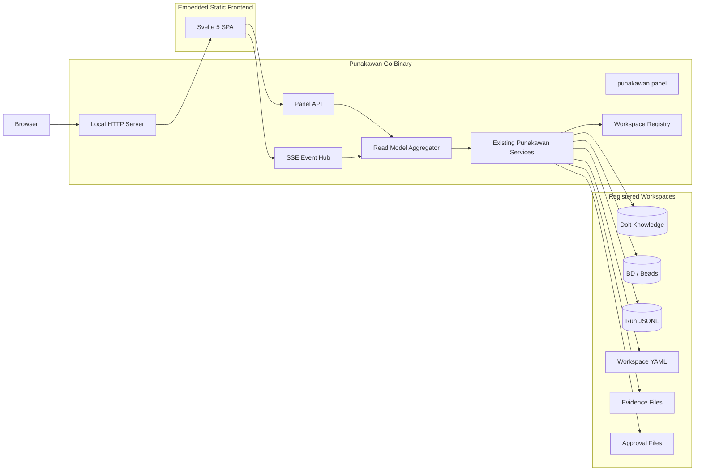

# Punakawan Panel Implementation Plan

**Status:** Proposed  
**Scope:** Local centralized visual tracker for Punakawan workspaces  
**Primary outcome:** A lightweight panel that lets the user inspect Punakawan knowledge, tasks, sessions, evidence, and approvals across local projects without introducing another database or a separately operated web service.  
**Target command:** `punakawan panel`  
**Default URL:** `http://127.0.0.1:7331`  
**Canonical backend language:** Go  
**Frontend:** Svelte 5 + TypeScript + Vite, compiled to static assets and embedded into the Go binary  
**Persistence:** Existing Punakawan stores only: Dolt, BD/Beads, YAML, and JSONL  
**New database:** None  
**Node.js at runtime:** None  

---

## 1. Executive Summary

Punakawan Panel is a local, centralized dashboard for observing Punakawan activity across multiple workspaces on one machine.

It is not a second orchestration service, a new source of truth, or a replacement for the Punakawan CLI. It is a visual read model over data that Punakawan already owns:

- Durable knowledge from Dolt and portable YAML.
- Work items and dependencies from BD/Beads.
- Session and workflow events from JSONL.
- Evidence bundles from `.punakawan/evidence/`.
- Approval records from `.punakawan/approvals/`.
- Workspace configuration from `.punakawan/workspace.yaml`.
- Git and adapter health from the existing capability-detection services.

The panel should run as part of the Punakawan Go binary:

```text
punakawan panel
  ├── starts a local HTTP server
  ├── serves embedded static frontend assets
  ├── discovers registered local workspaces
  ├── reads existing Punakawan data sources
  ├── exposes a read-oriented local API
  └── streams live changes using Server-Sent Events
```

The first release should be intentionally modest. It should answer five questions quickly:

1. What is Punakawan doing now?
2. Which workspace needs attention?
3. What tasks are blocked, active, or completed?
4. What durable knowledge exists and where did it come from?
5. What happened in a previous session, including evidence and failures?

The panel must not require:

- PostgreSQL, SQLite, Redis, or another panel-specific database.
- A separate Node.js server.
- Docker.
- A cloud account.
- Embeddings or a vector database.
- Jira availability.
- Git remote access.
- A second copy of task, knowledge, or run state.

---

## 2. Product Goals

### 2.1 Primary Goals

1. Provide one local dashboard for all registered Punakawan workspaces.
2. Show active and historical Punakawan sessions.
3. Visualize BD tasks, dependencies, blockers, and progress.
4. Browse durable knowledge and its provenance.
5. Search knowledge using the existing local exact, alias, BM25, fuzzy, and relation-expansion services.
6. Show evidence, approvals, Git state, and adapter health without exposing secrets.
7. Update the UI while a Punakawan session is running.
8. Work without adding a panel-specific database.
9. Ship as part of the existing Punakawan binary.
10. Remain useful when Jira, Confluence, Git remotes, or external adapters are unavailable.

### 2.2 Secondary Goals

1. Make interrupted or failed sessions understandable.
2. Make multi-repository relationships visible.
3. Expose stale, disputed, assumed, and superseded knowledge clearly.
4. Allow the user to copy stable Punakawan identifiers and source references.
5. Provide a clean foundation for carefully controlled actions in a later release.
6. Keep startup, memory use, and idle CPU consumption low.

---

## 3. Explicit Non-Goals

The initial panel must not become:

- A replacement for the Punakawan CLI.
- A full IDE or code editor.
- A generic project-management system.
- A Jira clone.
- A custom knowledge database.
- A vector-search interface.
- A remote multi-user web application.
- An internet-facing service.
- A place where hidden agent reasoning is displayed or stored.
- A control room that can push, deploy, merge, or modify external systems without the existing approval engine.
- A complex analytics product with dozens of charts that nobody asked for but everyone must maintain.

The MVP should be read-only except for safe local UI operations such as:

- Refreshing the view.
- Changing filters.
- Pinning a workspace in the local registry.
- Opening a file or directory through an explicit local action.
- Copying identifiers, paths, commands, or references.

Mutating Punakawan state should remain in the CLI until the panel's security and approval flow are implemented deliberately.

---

## 4. Core Architecture Decision

## 4.1 Recommended Architecture



### Why this architecture fits

- **One executable:** the panel ships with Punakawan rather than becoming another repository service that needs babysitting.
- **No runtime Node.js:** Svelte is only used during compilation.
- **No new database:** the backend reads existing canonical stores and builds short-lived in-memory views.
- **No duplicated business logic:** the panel API calls Punakawan services rather than parsing every format independently in the UI.
- **Local by default:** the server binds only to loopback.
- **Live enough without WebSocket complexity:** Server-Sent Events are sufficient because the primary flow is server-to-browser updates.
- **Portable:** the same binary can serve the UI on macOS, Linux, and Windows.

---

## 5. Technology Stack

| Layer | Choice | Reason |
|---|---|---|
| Local server | Go `net/http` | Already part of the trusted runtime; low overhead |
| API serialization | JSON | Easy to inspect, test, and consume |
| Live updates | Server-Sent Events | Simple one-way event stream with automatic reconnect |
| Frontend | Svelte 5 + TypeScript | Compact reactive UI and consistent with the broader TypeScript ecosystem |
| Frontend build | Vite | Fast static compilation |
| Styling | Local CSS variables and component styles | Avoid a large design-system dependency for a small local tool |
| Icons | Small bundled SVG icon set | No network dependency |
| Static delivery | Go `embed` | One binary and no external UI directory required |
| Workspace registry | YAML config file | Human-readable, portable, and not a database |
| Knowledge | Existing Dolt + YAML export | Canonical Punakawan source |
| Tasks | Existing BD/Beads source | No duplicated task state |
| Sessions | Existing JSONL journals and run summaries | Append-only, inspectable history |
| Search | Existing local retrieval service | Exact, aliases, BM25F, fuzzy fallback, one-hop relations |
| File watching | `fsnotify` with polling fallback | Efficient local refresh with cross-platform fallback |
| UI testing | Vitest plus Playwright | Component and end-to-end coverage |
| Backend testing | Go unit, integration, and contract tests | Keeps source adapters and API stable |

### Rejected alternatives

#### Separate SvelteKit server

Rejected because it requires a second runtime process and introduces deployment and lifecycle complexity with little benefit for a loopback-only panel.

#### Electron or Tauri desktop application

Rejected for the first release because a browser-served local panel is much simpler. Desktop packaging can be reconsidered only when the browser form becomes a proven limitation.

#### SQLite read model

Rejected because the panel does not need another durable source of truth. In-memory aggregation and disposable indexes are enough.

#### Direct browser access to `.punakawan/`

Rejected because the frontend should not understand Dolt, BD, JSONL, filesystem permissions, or secrets. Those boundaries belong in Go.

---

## 6. Runtime and Startup Flow

The primary command is:

```bash
punakawan panel
```

Supported options:

```bash
punakawan panel \
  --host 127.0.0.1 \
  --port 7331 \
  --open \
  --workspace /path/to/project \
  --log-level info
```

Recommended defaults:

```text
host: 127.0.0.1
port: 7331
open browser: true when an interactive desktop session is available
remote access: disabled
read-only mode: true
```

Startup sequence:

```text
1. Load global Punakawan configuration.
2. Load the local workspace registry.
3. Add the current workspace when started inside one.
4. Validate registered workspace paths.
5. Start source adapters in lazy mode.
6. Build a lightweight in-memory overview.
7. Bind the loopback HTTP server.
8. Start filesystem watchers.
9. Open the browser when requested.
10. Stream changes through SSE.
```

Shutdown sequence:

```text
1. Stop accepting new requests.
2. Close SSE connections.
3. Stop watchers and JSONL tailers.
4. Release workspace read locks.
5. Flush logs.
6. Exit without modifying canonical workspace data.
```

---

## 7. Workspace Registry

A central panel needs to know which local workspaces exist. Use a small human-readable registry, not a database.

Recommended path:

```text
Linux:
~/.config/punakawan/workspaces.yaml

macOS:
~/Library/Application Support/Punakawan/workspaces.yaml

Windows:
%APPDATA%\Punakawan\workspaces.yaml
```

Logical schema:

```yaml
version: punakawan.workspace-registry/v1

workspaces:
  - id: checkout-platform
    path: /Users/yunaz/projects/checkout-platform
    display_name: Checkout Platform
    pinned: true
    registered_at: 2026-07-23T10:00:00+07:00
    last_seen_at: 2026-07-23T10:15:00+07:00

  - id: setara
    path: /Users/yunaz/projects/setara
    display_name: Setara
    pinned: false
    registered_at: 2026-07-23T10:04:00+07:00
    last_seen_at: 2026-07-23T10:04:00+07:00
```

Rules:

- Punakawan automatically registers a workspace when it successfully detects `.punakawan/workspace.yaml`.
- A path is never treated as valid solely because it appears in the registry.
- Missing paths remain visible as `Unavailable` until removed.
- Duplicate physical paths are rejected.
- Renaming a display label does not change the stable workspace ID.
- The registry stores only panel discovery metadata.
- Canonical workspace configuration remains in the workspace itself.

CLI support:

```bash
punakawan workspace register .
punakawan workspace list
punakawan workspace remove checkout-platform
punakawan workspace pin checkout-platform
punakawan workspace unpin checkout-platform
punakawan panel --workspace .
```

---

## 8. Data Source Boundaries

The panel backend must consume existing Punakawan service interfaces. It should not scatter format-specific parsing throughout HTTP handlers.

```go
type WorkspaceReader interface {
    List(ctx context.Context) ([]WorkspaceSummary, error)
    Get(ctx context.Context, workspaceID string) (WorkspaceDetail, error)
}

type SessionReader interface {
    List(ctx context.Context, workspaceID string, filter SessionFilter) ([]SessionSummary, error)
    Get(ctx context.Context, workspaceID, sessionID string) (SessionDetail, error)
}

type TaskReader interface {
    List(ctx context.Context, workspaceID string, filter TaskFilter) ([]TaskSummary, error)
    Get(ctx context.Context, workspaceID, taskID string) (TaskDetail, error)
    Dependencies(ctx context.Context, workspaceID string) (TaskGraph, error)
}

type KnowledgeReader interface {
    Search(ctx context.Context, query KnowledgeQuery) (KnowledgeSearchResult, error)
    Get(ctx context.Context, workspaceID, knowledgeID string) (KnowledgeDetail, error)
    Relations(ctx context.Context, workspaceID, knowledgeID string) ([]KnowledgeRelation, error)
}

type EvidenceReader interface {
    List(ctx context.Context, workspaceID, sessionID string) ([]EvidenceSummary, error)
    Get(ctx context.Context, workspaceID, evidenceID string) (EvidenceDetail, error)
}

type ApprovalReader interface {
    List(ctx context.Context, workspaceID string, filter ApprovalFilter) ([]ApprovalSummary, error)
}
```

### 8.1 Knowledge

Source priority:

```text
Dolt canonical knowledge
  → portable YAML projection when Dolt is unavailable
  → explicit unavailable status when neither can be read
```

The panel must preserve:

- Stable ID.
- Type.
- Title and summary.
- Validity state.
- Trust level.
- Source reference.
- Content hash.
- Creation and update time.
- Relations.
- Affected repositories and components.

### 8.2 Tasks

Source priority:

```text
BD / Beads canonical work graph
  → exported task YAML or JSON when available
  → unavailable state rather than fabricated task data
```

The panel must preserve:

- Task ID.
- Title.
- Status.
- Priority.
- Owner or role.
- Dependencies.
- Blockers.
- Related requirements.
- Related sessions.
- Related Git changes.
- External Jira mapping when configured.

### 8.3 Sessions

A panel-facing session is one top-level Punakawan run.

Backend terminology may continue using `run`; the UI may label it `Session` for clarity.

Each completed or active run should expose a compact summary:

```yaml
id: run-20260723-001
workspace_id: checkout-platform
workflow: feature-delivery
status: executing
started_at: 2026-07-23T10:12:04+07:00
updated_at: 2026-07-23T10:13:41+07:00
initiator: user
objective: Add refund validation
current_phase: implementation
active_role: petruk
task_counts:
  total: 8
  pending: 3
  active: 1
  blocked: 1
  completed: 3
evidence_count: 12
warning_count: 2
error_count: 0
```

The core runtime should write `summary.yaml` as part of normal run checkpointing:

```text
.punakawan/runs/<run-id>/
├── summary.yaml
├── events.jsonl
├── capsules/
├── outputs/
└── checkpoints/
```

This is not panel-specific persistence. The same summary supports recovery, CLI inspection, and audit.

### 8.4 Evidence

The panel should show metadata first and load large evidence only when opened.

Supported evidence previews:

- Command result.
- Build or test report.
- Git diff summary.
- API compatibility result.
- Screenshot thumbnail.
- Playwright trace metadata.
- Source excerpt.
- Approval record.
- Agent output contract.
- Review finding.

Large raw logs must be truncated in the initial response and fetched through paginated or ranged endpoints.

### 8.5 Approvals

The MVP shows approvals but does not approve or reject them in the browser.

States:

- Pending.
- Approved.
- Rejected.
- Expired.
- Cancelled.

A pending approval should show:

- Requested operation.
- Target.
- Reason.
- Requesting role.
- Preview.
- Creation time.
- Related task and session.
- The CLI command needed to resolve it.

---

## 9. Read Model Strategy Without a Database

The panel uses an in-memory read model.

```text
Canonical workspace data
  → source readers
  → normalized summaries
  → in-memory cache
  → local JSON API
  → Svelte UI
```

### Cache rules

- Cache only normalized summaries and recent detail responses.
- Use bounded least-recently-used caches.
- Apply short time-to-live values.
- Invalidate entries through filesystem events and Punakawan runtime events.
- Never treat cached state as canonical.
- Never write panel cache files into the workspace.
- Allow the whole cache to be discarded safely.

Suggested defaults:

```yaml
panel:
  cache:
    overview_ttl: 2s
    workspace_ttl: 5s
    session_list_ttl: 2s
    completed_session_ttl: 60s
    task_ttl: 3s
    knowledge_detail_ttl: 30s
    max_memory_mb: 128
```

### Failure isolation

One corrupted or unavailable workspace must not take down the panel.

Each workspace summary should include:

```ts
type WorkspaceAvailability =
  | "available"
  | "partially_available"
  | "busy"
  | "unavailable"
  | "invalid";
```

Errors must be attached to the affected source:

```json
{
  "source": "knowledge",
  "code": "DOLT_UNAVAILABLE",
  "message": "Knowledge store could not be opened",
  "recoverable": true
}
```

---

## 10. Search Strategy

The panel must reuse the Punakawan knowledge service. It must not implement browser-side search over exported data.

Per-workspace retrieval order:

```text
1. Exact stable identifier
2. Exact external identifier
3. Alias match
4. BM25F
5. Limited fuzzy fallback
6. One-hop relation expansion
```

No model call occurs during indexing or retrieval.

### 10.1 Global Search

Global search queries every available workspace through the same knowledge API.

Because BM25 scores from separate corpora are not directly comparable, combine ranked workspace results with Reciprocal Rank Fusion rather than pretending raw scores share a universal scale.

```text
workspace A ranked results ┐
workspace B ranked results ├─> Reciprocal Rank Fusion ─> global ranking
workspace C ranked results ┘
```

Result groups:

- Knowledge.
- Tasks.
- Sessions.
- Evidence.
- Repositories.
- External references.

Search syntax:

```text
refund
type:requirement refund
state:disputed
repo:checkout-api timeout
task:bd-a8f3
session:run-20260723-001
source:jira PAY-1842
```

The initial implementation should support simple terms and structured filters. It does not need a query language parser that appears to have escaped from a database conference.

---

## 11. API Design

Base path:

```text
/api/v1
```

### 11.1 System and Overview

```http
GET /api/v1/system
GET /api/v1/overview
GET /api/v1/events
```

`GET /system` returns:

- Panel version.
- Punakawan version.
- Server start time.
- Read-only status.
- Bound address.
- Registered workspace count.
- Watcher status.
- Feature flags.

`GET /overview` returns:

- Active sessions.
- Pending approvals.
- Blocked tasks.
- Workspace health.
- Recent sessions.
- Recent knowledge changes.
- Adapter warnings.

`GET /events` is the SSE stream.

### 11.2 Workspaces

```http
GET /api/v1/workspaces
GET /api/v1/workspaces/{workspaceId}
GET /api/v1/workspaces/{workspaceId}/health
GET /api/v1/workspaces/{workspaceId}/repositories
```

### 11.3 Sessions

```http
GET /api/v1/workspaces/{workspaceId}/sessions
GET /api/v1/workspaces/{workspaceId}/sessions/{sessionId}
GET /api/v1/workspaces/{workspaceId}/sessions/{sessionId}/timeline
GET /api/v1/workspaces/{workspaceId}/sessions/{sessionId}/capsules
GET /api/v1/workspaces/{workspaceId}/sessions/{sessionId}/evidence
```

Filters:

```text
status
workflow
role
date_from
date_to
task_id
repository_id
limit
cursor
```

### 11.4 Tasks

```http
GET /api/v1/workspaces/{workspaceId}/tasks
GET /api/v1/workspaces/{workspaceId}/tasks/{taskId}
GET /api/v1/workspaces/{workspaceId}/task-graph
```

Filters:

```text
status
priority
blocked
role
repository_id
external_issue
query
```

### 11.5 Knowledge

```http
GET /api/v1/search
GET /api/v1/workspaces/{workspaceId}/knowledge
GET /api/v1/workspaces/{workspaceId}/knowledge/{knowledgeId}
GET /api/v1/workspaces/{workspaceId}/knowledge/{knowledgeId}/relations
GET /api/v1/workspaces/{workspaceId}/knowledge/{knowledgeId}/history
```

### 11.6 Evidence and Approvals

```http
GET /api/v1/workspaces/{workspaceId}/evidence
GET /api/v1/workspaces/{workspaceId}/evidence/{evidenceId}
GET /api/v1/workspaces/{workspaceId}/approvals
GET /api/v1/workspaces/{workspaceId}/approvals/{approvalId}
```

### 11.7 Pagination

Use cursor pagination for sessions, knowledge, tasks, and evidence.

```json
{
  "items": [],
  "next_cursor": "opaque-token",
  "has_more": true
}
```

Do not expose filesystem offsets, SQL cursors, or internal storage handles.

---

## 12. Live Event Model

Use Server-Sent Events:

```http
GET /api/v1/events
Accept: text/event-stream
```

Event envelope:

```json
{
  "id": "evt-20260723-000128",
  "type": "task.updated",
  "occurred_at": "2026-07-23T10:15:21+07:00",
  "workspace_id": "checkout-platform",
  "session_id": "run-20260723-001",
  "entity_id": "bd-a8f3",
  "revision": 14,
  "payload": {}
}
```

Required event types:

```text
system.ready
system.warning
workspace.registered
workspace.updated
workspace.availability_changed
session.started
session.phase_changed
session.progress
session.completed
session.failed
task.created
task.updated
task.blocked
task.completed
knowledge.created
knowledge.updated
knowledge.superseded
approval.requested
approval.resolved
evidence.created
git.state_changed
adapter.health_changed
```

Frontend behavior:

- Reconnect automatically.
- Use `Last-Event-ID` when possible.
- Refetch affected summaries after reconnect.
- Ignore duplicate or older revisions.
- Show a connection indicator.
- Never assume an SSE event alone contains a complete canonical object.

### Event sources

1. Direct Punakawan runtime event bus when the panel runs in the same process.
2. JSONL tailing for sessions created by another Punakawan process.
3. Filesystem watching for tasks, approvals, evidence, and workspace changes.
4. Periodic reconciliation as a fallback.

---

## 13. Panel Information Architecture

```text
Punakawan Panel
├── Overview
├── Workspaces
│   └── Workspace Detail
│       ├── Summary
│       ├── Sessions
│       ├── Tasks
│       ├── Knowledge
│       ├── Evidence
│       ├── Approvals
│       └── Health
├── Global Search
└── System
```

### Primary navigation

Desktop:

```text
Left sidebar
  Overview
  Workspaces
  Search
  System

Workspace section
  Pinned workspaces
  Recent workspaces
```

Compact screens:

```text
Top bar
  Workspace switcher
  Search
  Connection status

Bottom or drawer navigation
```

The panel is laptop-first. It should remain usable on a tablet, but the first release does not need to pretend engineers inspect task graphs for pleasure on a narrow phone screen.

---

## 14. Page Specifications

## 14.1 Overview

Purpose:

Show the current state of the entire local Punakawan installation.

Header:

- `Punakawan Panel`
- Global search.
- Live connection indicator.
- Current time and last refresh.
- Read-only badge.

Summary cards:

- Active sessions.
- Blocked tasks.
- Pending approvals.
- Available workspaces.

Main sections:

### Active Now

Each active session card shows:

- Workspace.
- Objective.
- Workflow.
- Current phase.
- Active role.
- Progress.
- Duration.
- Current task.
- Warning or error count.

### Needs Attention

Prioritized list:

1. Failed session.
2. Pending approval blocking a run.
3. Blocked task.
4. Unavailable workspace.
5. Adapter or knowledge-store failure.
6. Stale active session.

### Recent Sessions

Compact table:

| Started | Workspace | Objective | Workflow | Status | Duration |
|---|---|---|---|---|---|

### Knowledge Activity

Recent:

- Verified decisions.
- New requirements.
- Superseded records.
- Disputed claims.
- Stale knowledge warnings.

Do not add generic vanity charts in the MVP. Counts and actionable lists are more useful than decorative lines proving that time has passed.

---

## 14.2 Workspaces

Purpose:

Show all registered local workspaces and their availability.

Workspace card:

- Display name.
- Stable ID.
- Path.
- Availability.
- Repository count.
- Active session count.
- Open and blocked task counts.
- Knowledge record count.
- Last activity.
- Git summary.
- Adapter warnings.
- Pinned state.

Filters:

- Available.
- Active.
- Needs attention.
- Pinned.
- Recently used.

Sort:

- Pinned first.
- Recent activity.
- Name.
- Attention severity.

Empty state:

```text
No Punakawan workspaces are registered.

Run Punakawan inside a project or use:
punakawan workspace register /path/to/project
```

---

## 14.3 Workspace Summary

Header:

- Workspace name and ID.
- Path.
- Availability.
- Repository pills.
- Last activity.
- Open in terminal or file browser action.
- Git and adapter health.

Summary cards:

- Active session.
- Open tasks.
- Blocked tasks.
- Pending approvals.
- Verified knowledge.
- Warnings.

Sections:

- Current activity.
- Recent sessions.
- Task status.
- Knowledge health.
- Repository relationships.
- Latest evidence.
- Source health.

Repository relationship view:

```text
checkout-e2e --tests--> checkout-api
checkout-deployment --deploys--> checkout-api
```

Use a compact list or small SVG relationship map. A sprawling galaxy graph is not required to explain three repositories.

---

## 14.4 Sessions

List columns:

| Started | Objective | Workflow | Status | Phase | Role | Tasks | Duration |
|---|---|---|---|---|---|---|---|

Status values:

- Created.
- Context building.
- Awaiting clarification.
- Planning.
- Awaiting approval.
- Executing.
- Reviewing.
- Blocked.
- Completed.
- Failed.
- Cancelled.
- Interrupted.

Session detail:

### Summary

- Objective.
- Status.
- Workflow.
- Initiator.
- Start and end time.
- Duration.
- Current phase.
- Active role.
- Related repositories.
- Related tasks.
- Warning and error counts.

### Timeline

Chronological event stream grouped by workflow phase:

```text
10:12:04  Session started
10:12:05  Project capability detection completed
10:12:06  Knowledge retrieval completed
10:12:09  Gareng analysis started
10:12:18  Gareng reported one blocker
10:12:21  Plan synthesis completed
10:12:40  Petruk implementation started
```

Provide:

- Event type.
- Role.
- Short message.
- Duration.
- Related entity.
- Expandable structured payload.
- Evidence link.

### Role Lane

A simple phase lane:

```text
Semar  [context] [synthesis]                  [final]
Gareng           [analysis]
Petruk                       [plan] [implement]
Bagong                                           [review]
```

### Tasks

Show task progress and dependencies scoped to the session.

### Context Capsules

Show metadata only:

- Capsule ID.
- Role.
- Digest.
- Objective.
- Knowledge reference count.
- Evidence reference count.
- Allowed tools.
- Forbidden actions.

Do not display hidden reasoning.

### Evidence

Group by task and type.

### Errors and Recovery

Show:

- Failure point.
- Last successful checkpoint.
- Recoverability.
- Reconciliation status.
- Suggested CLI inspection command.

---

## 14.5 Tasks

Default views:

1. Status board.
2. Compact table.
3. Dependency view.

### Status Board

Columns:

- Pending.
- Ready.
- Active.
- Blocked.
- Review.
- Completed.
- Failed.

Task card:

- ID.
- Title.
- Priority.
- Assigned role.
- Repository.
- Blocking reason.
- Dependency count.
- External Jira key when mapped.
- Related session.
- Last update.

### Dependency View

MVP implementation:

- Deterministic layered layout.
- CSS grid for nodes.
- SVG connectors.
- Horizontal or vertical orientation.
- Pan only when the graph exceeds the viewport.
- No free-form node editing.
- No dependency mutation.

Node states:

- Ready.
- Active.
- Blocked.
- Completed.
- Failed.
- External.

Clicking a node opens a task detail drawer.

Task detail:

- Description.
- Acceptance criteria.
- Status history.
- Dependencies and dependants.
- Related requirements.
- Related knowledge.
- Related evidence.
- Related commits or PR.
- External issue mapping.
- Unresolved findings.

---

## 14.6 Knowledge

Default layout:

```text
Filter rail | Result list | Detail panel
```

Filters:

- Type.
- Validity state.
- Trust level.
- Repository.
- Component.
- Source provider.
- Updated date.
- Has conflict.
- Has relation.
- Stale only.

Knowledge list row:

- Type icon.
- Stable ID.
- Title.
- Short summary.
- Validity badge.
- Source.
- Repository.
- Updated time.

Knowledge detail:

### Main content

- Title.
- Stable ID.
- Type.
- Status.
- Summary or normalized content.
- Validity and trust.
- Created and updated time.

### Provenance

- Source provider.
- External ID.
- URI.
- Version.
- Section.
- Content hash.
- Retrieval time.
- Extraction method.
- Confidence.
- Verification actor and time.

### Relations

Grouped by relation:

- Derived from.
- Implements.
- Validates.
- Tested by.
- Depends on.
- Conflicts with.
- Supersedes.
- Owned by.
- Applies to.
- Verified by.

### History

- Created.
- Verified.
- Updated.
- Disputed.
- Superseded.
- Invalidated.

### Search result explanation

Show why a result matched:

```text
Exact identifier
Alias match
Title BM25
Body BM25
Relation expansion
Fuzzy fallback
```

Do not expose a fake “AI confidence” for deterministic retrieval.

---

## 14.7 Evidence

Filters:

- Session.
- Task.
- Evidence type.
- Repository.
- Role.
- Success or failure.
- Date.

Evidence list:

- ID.
- Type.
- Title.
- Session.
- Task.
- Created time.
- Size.
- Hash.
- Availability.

Preview behavior:

- Text and JSON: syntax-highlighted, paginated.
- Diff: file summary first, hunks on demand.
- Screenshot: thumbnail then full local asset.
- Trace: metadata and local open command.
- Binary: metadata only.
- Large log: range loading and search.

Security:

- Redact secrets before data reaches the frontend.
- Reject path traversal.
- Serve only evidence files referenced by the workspace manifest or evidence index.
- Set restrictive content types and download headers.
- Never render arbitrary workspace HTML as trusted HTML.

---

## 14.8 Approvals

MVP behavior is read-only.

Approval row:

- Operation.
- Target.
- Status.
- Requesting role.
- Session.
- Task.
- Requested time.
- Resolved time.

Pending approval detail:

- Human-readable reason.
- Exact side effect.
- Preview.
- Policy rule.
- Related evidence.
- CLI command to approve or reject.

Future write support must go through:

```text
Panel action
  → CSRF and origin validation
  → Punakawan approval service
  → policy evaluation
  → explicit confirmation
  → durable approval record
  → event stream update
```

The frontend must never write approval files directly.

---

## 14.9 System

Show:

- Punakawan version.
- Panel version.
- Runtime OS and architecture.
- Uptime.
- Bound address.
- Read-only status.
- Workspace registry path.
- Registered and available workspace counts.
- Active watchers.
- SSE clients.
- Cache usage.
- Source adapter health.
- Tool availability.
- Recent panel warnings.

Do not show:

- Tokens.
- Secret values.
- Full environment variables.
- Raw authentication headers.
- Private keys.
- Hidden model prompts.
- Agent chain-of-thought.

---

## 15. Visual Design Direction

The panel should feel like an engineering instrument, not a corporate portal that has mistaken gradients for insight.

### Principles

- Dense enough for technical work.
- Calm hierarchy.
- Clear status colors.
- Minimal animation.
- Strong empty and error states.
- Keyboard-friendly.
- Readable on a laptop without horizontal wandering.
- No remote fonts.
- No network-loaded icons or assets.

### Layout

```text
Sidebar: 220–260 px
Top bar: 52–60 px
Content max width: none for tables, sensible width for prose
Detail drawer: 420–560 px
Panel gap: 12–16 px
```

### Status semantics

| Status | Meaning |
|---|---|
| Neutral | Informational or idle |
| Active | Work is in progress |
| Success | Verified completion |
| Warning | Attention needed but workflow may continue |
| Danger | Failed, blocked, or unsafe |
| Muted | Unavailable, skipped, or superseded |

Color must never be the only signal. Pair every status with text and an icon.

### Motion

Use motion only for:

- Live activity indicators.
- Drawer transitions.
- Updated-row highlights.
- Expand and collapse.
- SSE reconnect state.
- Progress transitions.

Respect `prefers-reduced-motion`.

---

## 16. Accessibility

Minimum requirements:

- Keyboard navigation for every interactive control.
- Visible focus states.
- Proper landmarks and headings.
- Accessible names for icon-only controls.
- Status changes announced through polite live regions.
- Dialog and drawer focus trapping.
- Escape closes drawers and dialogs.
- Tables retain semantic headers.
- Task graphs have an equivalent list representation.
- Contrast meets WCAG AA.
- Reduced-motion support.
- No information conveyed by color alone.

---

## 17. Security Model

## 17.1 Network Boundary

Default binding:

```text
127.0.0.1 only
```

Also bind IPv6 loopback when supported:

```text
::1
```

Reject:

- Non-loopback binding unless an explicit future feature enables it.
- Unexpected `Host` headers.
- Cross-origin requests.
- DNS rebinding attempts.
- Requests without the correct local session token for mutation endpoints.

### Read-only MVP

The API should expose only `GET` and SSE endpoints in the first release, except a narrowly scoped local refresh action if required.

### Headers

Use:

```text
Content-Security-Policy
X-Content-Type-Options: nosniff
Referrer-Policy: no-referrer
Permissions-Policy
Cross-Origin-Resource-Policy: same-origin
Cache-Control appropriate to endpoint
```

CSP should disallow remote scripts, frames, and connections.

## 17.2 Filesystem Boundary

- Resolve and validate every workspace root.
- Reject symlink escapes outside approved roots.
- Do not serve arbitrary paths.
- Use stable evidence IDs rather than user-supplied file paths.
- Open Dolt and BD in read-only mode where supported.
- Use short read locks.
- Do not block active Punakawan writes longer than necessary.

## 17.3 Secret Redaction

All source readers must pass values through the existing redaction service before they reach:

- API responses.
- Panel logs.
- SSE events.
- Browser previews.
- Error messages.

## 17.4 Prompt and Content Safety

External source content is evidence, not an instruction to the panel.

- Render external text as untrusted content.
- Escape Markdown and HTML.
- Do not execute links or commands automatically.
- Mark content originating from Jira, Confluence, documents, or browser recordings.
- Prevent embedded scripts and unsafe URLs.

---

## 18. Performance Targets

Typical local corpus target:

- Up to 20 registered workspaces.
- Up to 100 repositories.
- Up to 100,000 knowledge records total.
- Up to 50,000 tasks total.
- Up to 10,000 sessions.
- Multi-gigabyte historical evidence, loaded lazily.

Targets:

| Operation | Target |
|---|---:|
| Panel server startup | under 1 second before browser launch |
| Initial overview, warm sources | under 500 ms |
| Initial overview, cold sources | under 2 seconds |
| Workspace switch | under 300 ms after summary cache |
| Exact knowledge lookup | under 50 ms |
| Typical BM25 query | under 200 ms |
| Session list | under 200 ms |
| Live update visible in UI | under 1 second |
| Idle panel memory | under 150 MB including UI cache |
| Idle CPU | effectively zero outside watcher events |

Performance rules:

- Do not parse every historical JSONL file at startup.
- Prefer run summaries and indexes.
- Read evidence lazily.
- Bound all list responses.
- Use cursor pagination.
- Cancel work when the browser cancels a request.
- Debounce filesystem bursts.
- Reconcile periodically rather than continuously polling everything.

---

## 19. Source Refresh and File Watching

Watch:

```text
global workspace registry
workspace.yaml
policy.yaml
tasks exports or BD change indicators
runs/*/summary.yaml
runs/*/events.jsonl for active runs
approvals/**
evidence indexes
knowledge change metadata
Git HEAD and index state
```

Do not recursively watch huge directories without limits.

Refresh strategy:

```text
Direct runtime event
  → immediate invalidation

Filesystem event
  → debounce 250 ms
  → invalidate affected entity
  → emit SSE summary event

Watcher failure
  → mark degraded
  → poll affected workspace every 5 seconds

Periodic reconciliation
  → verify versions and hashes every 30 seconds
```

JSONL tailing:

- Track offsets in memory.
- Detect truncation and rotation.
- Validate each event envelope.
- Skip malformed lines and report them.
- Never stop the entire stream because one line is corrupt.
- On restart, load the run summary and tail only the active journal.

---

## 20. Suggested Repository Layout

```text
punakawan/
├── cmd/
│   └── punakawan/
│       └── panel_command.go
├── internal/
│   ├── panel/
│   │   ├── app.go
│   │   ├── server/
│   │   │   ├── server.go
│   │   │   ├── routes.go
│   │   │   ├── middleware.go
│   │   │   ├── security.go
│   │   │   └── static.go
│   │   ├── api/
│   │   │   ├── system_handler.go
│   │   │   ├── overview_handler.go
│   │   │   ├── workspace_handler.go
│   │   │   ├── session_handler.go
│   │   │   ├── task_handler.go
│   │   │   ├── knowledge_handler.go
│   │   │   ├── evidence_handler.go
│   │   │   └── approval_handler.go
│   │   ├── readmodel/
│   │   │   ├── aggregator.go
│   │   │   ├── cache.go
│   │   │   └── mapper.go
│   │   ├── events/
│   │   │   ├── hub.go
│   │   │   ├── sse.go
│   │   │   ├── watcher.go
│   │   │   └── reconciler.go
│   │   ├── registry/
│   │   │   ├── registry.go
│   │   │   ├── file_store.go
│   │   │   └── validation.go
│   │   ├── sources/
│   │   │   ├── workspace_source.go
│   │   │   ├── session_source.go
│   │   │   ├── task_source.go
│   │   │   ├── knowledge_source.go
│   │   │   ├── evidence_source.go
│   │   │   └── approval_source.go
│   │   ├── model/
│   │   ├── contract/
│   │   └── assets/
│   │       └── dist/
│   └── workspace/
│       └── registry/
├── web/
│   └── panel/
│       ├── package.json
│       ├── vite.config.ts
│       ├── tsconfig.json
│       ├── src/
│       │   ├── app/
│       │   ├── lib/
│       │   │   ├── api/
│       │   │   ├── events/
│       │   │   ├── stores/
│       │   │   ├── components/
│       │   │   ├── formatting/
│       │   │   └── accessibility/
│       │   ├── routes/
│       │   │   ├── overview/
│       │   │   ├── workspaces/
│       │   │   ├── sessions/
│       │   │   ├── tasks/
│       │   │   ├── knowledge/
│       │   │   ├── evidence/
│       │   │   ├── approvals/
│       │   │   └── system/
│       │   └── styles/
│       └── tests/
├── protocol/
│   └── panel/
│       ├── system.schema.json
│       ├── overview.schema.json
│       ├── workspace.schema.json
│       ├── session.schema.json
│       ├── task.schema.json
│       ├── knowledge.schema.json
│       ├── evidence.schema.json
│       ├── approval.schema.json
│       └── event.schema.json
└── test/
    ├── panel/
    │   ├── fixtures/
    │   ├── integration/
    │   └── e2e/
    └── workspaces/
```

---

## 21. Build and Packaging

Build flow:

```text
pnpm --filter @punakawan/panel build
  → writes static assets
  → asset manifest generated
  → Go embeds assets
  → Go binary built
```

Commands:

```bash
make panel-dev
make panel-build
make panel-test
make panel-e2e
make panel-contract-check
make build
```

Suggested implementation:

```go
//go:embed assets/dist/*
var panelAssets embed.FS
```

Development mode:

```bash
# terminal 1
go run ./cmd/punakawan panel --dev-api --port 7331

# terminal 2
pnpm --filter @punakawan/panel dev
```

The Vite development server proxies `/api/v1` to the Go server.

Release mode:

- Only the Go binary runs.
- Static assets are embedded.
- Source maps are excluded or stored separately.
- Asset filenames are content-hashed.
- The release build fails when generated API types are stale.

Cross-platform release targets:

- macOS arm64.
- macOS amd64 if still supported.
- Linux amd64.
- Linux arm64.
- Windows amd64.

---

## 22. API Contract and Type Generation

Panel API schemas should be language-neutral.

Generate:

- Go response and request structs.
- TypeScript interfaces.
- Runtime validators for the frontend.
- Example fixtures.
- Contract documentation.

CI rules:

- Reject incompatible response changes without a version update.
- Reject stale generated code.
- Run contract fixtures against the Go handlers.
- Validate SSE event payloads.
- Keep optional fields explicit.
- Never use untyped arbitrary maps for core entities.

---

## 23. Testing Strategy

## 23.1 Go Unit Tests

Cover:

- Registry path validation.
- Duplicate workspace handling.
- Missing workspace handling.
- Source fallback behavior.
- Read-only opening.
- Cache invalidation.
- Cursor pagination.
- SSE replay and deduplication.
- JSONL truncation and malformed lines.
- Secret redaction.
- Path traversal rejection.
- Host and origin validation.
- Workspace failure isolation.

## 23.2 Source Integration Tests

Fixtures:

- Healthy single repository.
- Multi-repository workspace.
- Local-only Git repository.
- Missing Dolt.
- Corrupted knowledge YAML.
- BD unavailable.
- Jira mapping without Jira connectivity.
- Active session.
- Interrupted session.
- Failed session.
- Pending approval.
- Large evidence bundle.
- Stale workspace path.

## 23.3 Frontend Tests

Cover:

- Overview states.
- Empty states.
- Loading states.
- Partial source failure.
- SSE reconnect.
- Keyboard navigation.
- Task board and dependency fallback list.
- Knowledge filters.
- Session timeline.
- Large log pagination.
- Error boundaries.

## 23.4 End-to-End Tests

Required flows:

1. Start panel with no registered workspaces.
2. Register a fixture workspace.
3. Open workspace summary.
4. Start a simulated session and observe live progress.
5. Open a task and inspect dependencies.
6. Search by stable knowledge ID.
7. Search by BM25 term.
8. Open provenance and relations.
9. Inspect failed evidence.
10. Lose and restore the SSE connection.
11. Corrupt one workspace and verify other workspaces remain usable.
12. Verify mutation endpoints do not exist in read-only MVP.

## 23.5 Performance Tests

- 20 workspaces.
- 100,000 knowledge records.
- 50,000 tasks.
- 10,000 session summaries.
- One active high-frequency JSONL stream.
- Large evidence directories.
- Filesystem event burst.
- Ten concurrent browser tabs.

---

## 24. Implementation Phases

## Phase 0: Contracts and Prerequisites

**Goal:** Make existing Punakawan data reliably consumable.

Tasks:

- Define panel API schemas.
- Define session summary schema.
- Ensure every run writes `summary.yaml`.
- Ensure evidence has an index or manifest.
- Define task reader abstraction over BD.
- Expose read-only knowledge-service interfaces.
- Define the workspace registry schema.
- Define the panel event envelope.
- Add source health contracts.

Deliverable:

```text
Stable read contracts exist before UI implementation begins.
```

Exit criteria:

- Schemas validate fixtures.
- Existing runtime can produce run summaries.
- Panel can read one fixture workspace without UI code.

---

## Phase 1: Local Server and Workspace Registry

**Goal:** Start a secure local server and discover workspaces.

Tasks:

- Add `punakawan panel`.
- Implement loopback-only HTTP binding.
- Implement static-asset embedding.
- Implement workspace registry.
- Auto-register the current workspace.
- Validate workspace paths.
- Add `/system`, `/workspaces`, and `/overview`.
- Add security headers.
- Add structured panel logs.
- Add graceful shutdown.

Deliverable:

```text
The embedded panel opens and lists registered workspaces.
```

Exit criteria:

- No Node.js runtime is needed.
- No database is created.
- Missing workspaces appear as unavailable.
- Non-loopback access is rejected.

---

## Phase 2: Overview and Workspace Summary

**Goal:** Make the panel useful before implementing every detail page.

Tasks:

- Build the main shell and navigation.
- Add overview cards.
- Add Active Now.
- Add Needs Attention.
- Add Recent Sessions.
- Add workspace cards.
- Add workspace summary page.
- Add source health display.
- Add responsive behavior.
- Add empty, partial failure, and unavailable states.

Deliverable:

```text
The user can understand the overall Punakawan state within a few seconds.
```

Exit criteria:

- Active runs and blocked work are visible.
- One broken workspace does not break the page.
- Keyboard navigation works.

---

## Phase 3: Sessions and Live Updates

**Goal:** Explain current and historical Punakawan execution.

Tasks:

- Add session list and detail APIs.
- Implement run-summary reader.
- Implement JSONL timeline reader.
- Implement SSE event hub.
- Add active-session progress.
- Add phase timeline.
- Add role lane.
- Add context-capsule metadata.
- Add error and recovery section.
- Add reconnection and stale-session handling.

Deliverable:

```text
An active Punakawan session can be followed live and inspected afterward.
```

Exit criteria:

- Session changes appear within one second.
- Reconnect does not duplicate events.
- Interrupted sessions show the last checkpoint.

---

## Phase 4: Tasks and Dependency View

**Goal:** Visualize the BD work graph.

Tasks:

- Add task list and detail readers.
- Add status board.
- Add filters and search.
- Add task detail drawer.
- Add deterministic dependency layout.
- Add accessible list fallback.
- Link tasks to sessions, knowledge, evidence, repositories, and external issues.
- Show blocker reasons and stale tasks.

Deliverable:

```text
The user can see what is ready, active, blocked, and dependent on other work.
```

Exit criteria:

- Dependency cycles are detected and displayed.
- Large task graphs remain usable.
- The panel does not modify BD state.

---

## Phase 5: Knowledge Browser and Global Search

**Goal:** Make durable knowledge inspectable and searchable.

Tasks:

- Add knowledge list and detail APIs.
- Add provenance and validity display.
- Add relation browser.
- Add knowledge history.
- Add global search.
- Reuse exact, alias, BM25F, fuzzy, and relation-expansion services.
- Add Reciprocal Rank Fusion for cross-workspace ranking.
- Add result-match explanations.
- Add filters for type, state, repository, source, and staleness.

Deliverable:

```text
The user can find and verify durable knowledge without embeddings or model calls.
```

Exit criteria:

- Stable ID lookup is deterministic.
- Typical BM25 query meets the latency target.
- Search clearly distinguishes verified, assumed, disputed, and superseded records.

---

## Phase 6: Evidence, Approvals, and Health

**Goal:** Complete the audit and diagnostic views.

Tasks:

- Add evidence list and safe previews.
- Add ranged log loading.
- Add diff summaries.
- Add screenshot previews.
- Add approval list and detail.
- Add CLI resolution commands for pending approvals.
- Add source-adapter health.
- Add Git health.
- Add panel-system page.
- Add secret-redaction tests.

Deliverable:

```text
The user can trace a result from requirement to task, session, evidence, and approval.
```

Exit criteria:

- Arbitrary workspace paths cannot be served.
- Large evidence does not block page loading.
- Secrets never reach API fixtures or browser tests.

---

## Phase 7: Packaging, Hardening, and Release

**Goal:** Ship a reliable local feature.

Tasks:

- Add embedded production assets.
- Add cross-platform packaging.
- Add release version metadata.
- Add upgrade compatibility tests.
- Add performance fixtures.
- Add corrupted-workspace tests.
- Add accessibility audit.
- Add CSP and DNS-rebinding tests.
- Add documentation.
- Add migration notes.
- Add troubleshooting commands.

Deliverable:

```text
Punakawan Panel ships inside the normal Punakawan release.
```

Exit criteria:

- All target binaries contain the UI.
- `punakawan panel` works without Node.js or Docker.
- No new database or service is required.
- Security and accessibility checks pass.

---

## 25. Detailed Initial Backlog

### Foundation

- `PANEL-001` Define panel API versioning policy.
- `PANEL-002` Define workspace registry schema.
- `PANEL-003` Define session summary schema.
- `PANEL-004` Define panel event schema.
- `PANEL-005` Add generated Go and TypeScript contract types.
- `PANEL-006` Add panel fixture workspaces.

### Server

- `PANEL-010` Add `punakawan panel` command.
- `PANEL-011` Add loopback HTTP server.
- `PANEL-012` Add static asset embedding.
- `PANEL-013` Add security middleware.
- `PANEL-014` Add graceful shutdown.
- `PANEL-015` Add browser launch helper.
- `PANEL-016` Add panel system endpoint.

### Registry and Sources

- `PANEL-020` Implement global workspace registry.
- `PANEL-021` Add workspace auto-registration.
- `PANEL-022` Add workspace validation.
- `PANEL-023` Add workspace source health.
- `PANEL-024` Add in-memory read model.
- `PANEL-025` Add bounded cache.
- `PANEL-026` Add filesystem watcher.
- `PANEL-027` Add reconciliation fallback.

### UI Shell

- `PANEL-030` Scaffold Svelte panel.
- `PANEL-031` Add application shell.
- `PANEL-032` Add sidebar and workspace switcher.
- `PANEL-033` Add global search control.
- `PANEL-034` Add connection status.
- `PANEL-035` Add error boundary.
- `PANEL-036` Add accessibility primitives.

### Overview and Workspaces

- `PANEL-040` Add overview API.
- `PANEL-041` Add Active Now.
- `PANEL-042` Add Needs Attention.
- `PANEL-043` Add recent sessions.
- `PANEL-044` Add workspace list.
- `PANEL-045` Add workspace summary.
- `PANEL-046` Add source health display.

### Sessions

- `PANEL-050` Add run-summary writer to core runtime.
- `PANEL-051` Add session list API.
- `PANEL-052` Add session detail API.
- `PANEL-053` Add JSONL timeline reader.
- `PANEL-054` Add SSE event hub.
- `PANEL-055` Add live session progress.
- `PANEL-056` Add role lane.
- `PANEL-057` Add capsule metadata view.
- `PANEL-058` Add recovery diagnostics.

### Tasks

- `PANEL-060` Add BD read adapter.
- `PANEL-061` Add task list and filters.
- `PANEL-062` Add task status board.
- `PANEL-063` Add task detail drawer.
- `PANEL-064` Add task dependency API.
- `PANEL-065` Add dependency layout.
- `PANEL-066` Add accessible dependency list.
- `PANEL-067` Add cycle detection display.

### Knowledge

- `PANEL-070` Add knowledge list API.
- `PANEL-071` Add knowledge detail API.
- `PANEL-072` Add provenance view.
- `PANEL-073` Add relation view.
- `PANEL-074` Add knowledge history.
- `PANEL-075` Add global search API.
- `PANEL-076` Add RRF cross-workspace ranking.
- `PANEL-077` Add match explanation.
- `PANEL-078` Add search filters.

### Evidence and Approvals

- `PANEL-080` Add evidence index reader.
- `PANEL-081` Add safe evidence preview.
- `PANEL-082` Add log range API.
- `PANEL-083` Add diff preview.
- `PANEL-084` Add screenshot preview.
- `PANEL-085` Add approval list.
- `PANEL-086` Add approval detail.
- `PANEL-087` Add CLI resolution hint.

### Hardening

- `PANEL-090` Add secret-redaction boundary tests.
- `PANEL-091` Add path traversal tests.
- `PANEL-092` Add Host and Origin validation tests.
- `PANEL-093` Add DNS-rebinding tests.
- `PANEL-094` Add load and memory tests.
- `PANEL-095` Add cross-platform packaging.
- `PANEL-096` Add accessibility audit.
- `PANEL-097` Add user documentation.
- `PANEL-098` Add troubleshooting documentation.
- `PANEL-099` Add release checklist.

---

## 26. Configuration

Example:

```yaml
punakawan:
  panel:
    enabled: true
    host: 127.0.0.1
    port: 7331
    open_browser: true
    read_only: true

    registry:
      auto_register: true

    refresh:
      filesystem_watch: true
      debounce_ms: 250
      reconciliation_interval: 30s
      polling_fallback_interval: 5s

    cache:
      max_memory_mb: 128
      overview_ttl: 2s
      workspace_ttl: 5s
      completed_session_ttl: 60s
      knowledge_detail_ttl: 30s

    limits:
      default_page_size: 50
      max_page_size: 200
      max_log_chunk_bytes: 262144
      max_preview_bytes: 1048576
      max_sse_clients: 20

    security:
      allow_remote: false
      validate_host: true
      validate_origin: true
      serve_source_files: false
      redact_secrets: true
```

Configuration rules:

- `allow_remote` is ignored or rejected in the MVP.
- Workspace policy may further restrict exposed data.
- Panel configuration must not loosen core Punakawan filesystem or secret policy.
- CLI flags may override benign runtime settings such as port, but not security restrictions without an explicit future feature.

---

## 27. Observability

Use the existing Punakawan logging and telemetry interfaces.

Logs:

- Server start and stop.
- Workspace registration changes.
- Source read failures.
- Watcher degradation.
- Slow API calls.
- Cache pressure.
- SSE reconnect storms.
- Security rejections.

Metrics, when telemetry is enabled:

```text
punakawan_panel_http_requests_total
punakawan_panel_http_request_duration_seconds
punakawan_panel_sse_clients
punakawan_panel_workspace_available
punakawan_panel_source_errors_total
punakawan_panel_cache_entries
punakawan_panel_cache_bytes
punakawan_panel_search_duration_seconds
punakawan_panel_watcher_events_total
```

Telemetry remains optional. The panel must not require Prometheus, Grafana, or another service to function.

---

## 28. Migration and Compatibility

### Existing workspaces

- A workspace without a session summary remains readable.
- The panel may derive a limited summary from existing JSONL.
- The core runtime should create summaries for new runs.
- Historical backfill should be an explicit CLI command rather than an automatic expensive startup task.

```bash
punakawan runs rebuild-summaries --workspace .
```

### Existing knowledge

- Use current Dolt schema adapters.
- When an older schema is detected, show a compatibility warning.
- Do not migrate knowledge automatically from a read-only panel session.

### Existing BD tasks

- Use a versioned BD reader.
- Unsupported task fields appear under raw metadata only when safe.
- Jira IDs remain external mappings.

### API compatibility

- Panel API starts at `/api/v1`.
- Additive fields are allowed.
- Removed or retyped fields require `/api/v2`.
- The embedded frontend and backend are released together, but contracts should still be stable for tests and future integrations.

---

## 29. Risks and Mitigations

| Risk | Impact | Mitigation |
|---|---:|---|
| Parsing historical JSONL is slow | High | Require run summaries; load timelines lazily |
| Dolt is locked by another process | Medium | Short read attempts, busy state, retry |
| BD format changes | Medium | Versioned task-reader adapter |
| One workspace is corrupted | High | Per-workspace failure isolation |
| File watchers miss events | Medium | Periodic reconciliation |
| Global BM25 scores are incomparable | Medium | Use Reciprocal Rank Fusion |
| Browser exposes local sensitive data | High | Loopback binding, CSP, redaction, strict path boundary |
| Malicious webpage targets localhost | High | Host validation, Origin checks, no mutation API |
| Evidence files are huge | High | Index metadata, range loading, bounded previews |
| Task graph becomes unreadable | Medium | Filter, collapse, layered layout, list fallback |
| UI build complicates Go release | Medium | Embedded static build and generated-asset checks |
| Panel drifts from CLI semantics | High | Reuse core services and shared contracts |
| Panel becomes a second control plane | High | Read-only MVP and explicit non-goals |
| Registry is mistaken for canonical state | Low | Registry stores discovery metadata only |
| Too many charts obscure action | Surprisingly high | Prefer status, lists, timelines, and dependencies |

---

## 30. Acceptance Criteria

### Runtime

- `punakawan panel` starts the dashboard.
- The default server listens only on loopback.
- The panel opens without Node.js, Docker, or a database.
- Static assets are embedded in the Punakawan binary.
- Shutdown leaves no modified canonical workspace state.

### Workspaces

- Registered workspaces are visible in one centralized view.
- Starting Punakawan inside a workspace can register it automatically.
- Missing workspaces are shown as unavailable.
- One broken workspace does not break other workspace views.

### Sessions

- Active sessions update live.
- Historical sessions show status, objective, phase, tasks, timeline, and evidence.
- Interrupted sessions show the last durable checkpoint.
- Hidden reasoning is not exposed.

### Tasks

- BD tasks are shown without duplicating their state.
- Status, dependencies, blockers, related sessions, and external mappings are visible.
- The dependency view has an accessible list alternative.
- The panel does not mutate task status in the MVP.

### Knowledge

- Knowledge can be searched by stable ID, alias, BM25 text, and filters.
- No embedding or model call is used.
- Provenance, validity, trust, and relations are visible.
- Cross-workspace results use rank fusion rather than raw BM25 score comparison.

### Evidence and Approvals

- Evidence is loaded safely and lazily.
- Large logs and diffs do not block initial rendering.
- Pending approvals show the exact operation and CLI resolution route.
- No secret is returned to the browser.

### Security

- Remote requests are rejected.
- Unexpected Host and Origin values are rejected.
- Arbitrary filesystem paths cannot be fetched.
- Symlink path escapes are blocked.
- External HTML and Markdown are treated as untrusted.
- Mutation APIs are absent or disabled in the MVP.

### UX

- The user can identify active work and urgent problems within five seconds.
- The UI remains usable at common laptop widths.
- Keyboard navigation covers all core flows.
- Color is not the sole status indicator.
- Reduced-motion preference is respected.
- Loading, empty, partial, and error states are explicit.

### Performance

- The initial overview normally loads within two seconds from cold local sources.
- Live changes appear within one second.
- Typical knowledge search completes within 200 ms.
- The panel does not scan all historical evidence at startup.
- Idle resource use remains bounded.

---

## 31. Definition of Done

Punakawan Panel is complete for the first release when:

```text
A user can run one command on a local machine,
open one centralized dashboard,
see every registered Punakawan workspace,
follow active sessions,
inspect historical runs,
understand task dependencies and blockers,
search verified durable knowledge,
trace results to evidence and approvals,
and do all of this without a new database,
a cloud dependency,
a Node.js runtime,
or duplicated Punakawan state.
```

The panel should remain an observer of canonical Punakawan state. Once that boundary is reliable, carefully approved actions can be added later without turning a useful local tracker into an accidental operations console.
